# 多平台广告管理系统架构文档：登录 / 权限 / 路由 / 账号 / 平台

## 目录

1. [系统总览](#1-系统总览)
2. [登录系统](#2-登录系统)
3. [权限系统](#3-权限系统)
4. [路由系统](#4-路由系统)
5. [账号系统](#5-账号系统)
6. [平台系统](#6-平台系统)
7. [模块间关系图](#7-模块间关系图)

---

## 1. 系统总览

本应用是一个多平台广告管理系统，基于 Vue 2 + Vuex + Vue Router 构建。系统支持 Amazon、Walmart、Criteo、Instacart、CitrusAd 等多个广告平台，采用多租户架构，支持主/子账号体系。

### 核心技术栈

| 层级 | 技术 |
|------|------|
| 框架 | Vue 2 (Options API + Composition API 混用) |
| 状态管理 | Vuex (模块化) + Composition API reactive store (OmniCenter) |
| 路由 | Vue Router 3 (history mode) |
| HTTP | Axios (带拦截器) |
| Token 存储 | localStorage (`[app-token]`) |
| SSO | Cookie (`[sso_token_key]` @ `.[company-domain].com`) |

### 系统总体架构图

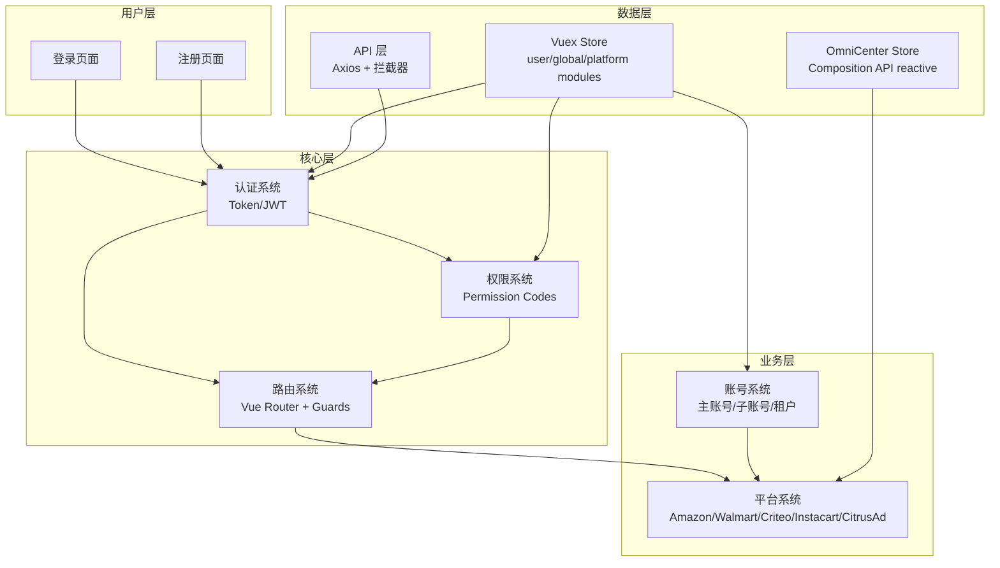

---

## 2. 登录系统

### 2.1 登录流程概览

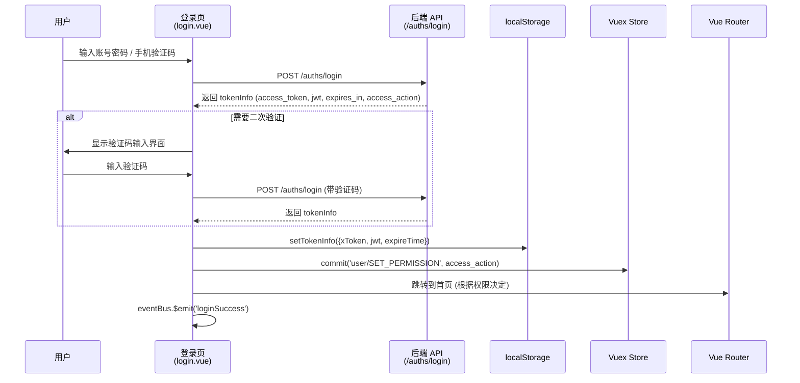

### 2.2 登录方式

系统支持以下登录方式：

| 方式 | 说明 | 文件 |
|------|------|------|
| 账号密码登录 | 用户名 + Base64 编码密码 | `views/login/login.vue` |
| 手机验证码登录 | 仅中文用户可用 | `views/login/login.vue` |
| URL Token 免登录 | URL 带 `?token=xxx` 自动登录 | `permission.js` + `api/login.js` |
| 二次验证 (2FA) | 短信/邮件验证码 | `views/login/login.vue` |

### 2.3 Token 管理

Token 存储在 localStorage 中，key 为 `[app-token]`，结构如下：

```javascript
// utils/auth.js
{
  xToken: string,      // X-Token，用于请求头
  jwt: string,         // JWT，用于 Authorization Bearer
  chatJwt: string,     // 第三方客服聊天 JWT
  expireTime: number   // 过期时间戳 (Date.now() + expires_in * 1000)
}
```

关键方法：
- `getTokenInfo()` — 从 localStorage 读取 token
- `setTokenInfo(tokenInfo)` — 写入 token
- `removeTokenInfo()` — 清除 token
- `isTokenValid()` — 判断 token 是否过期
- `getXToken()` — 获取 X-Token
- `getJwt()` — 获取 JWT

### 2.4 SSO 机制

登录成功后，系统会将 token 和用户信息写入 `.[company-domain].com` 域的 Cookie，实现跨子域 SSO：

```javascript
// utils/sso.js
setSsoCookie(token, expires)       // Cookie: [sso_token_key]
setSsoUserInfo(userInfo, expires)  // Cookie: [sso_user_info_key]
```

### 2.5 登录后首页路由决策

```mermaid
flowchart TD
    A[登录成功] --> B{有 HomePageV2 权限?}
    B -->|是| C[/home_new]
    B -->|否| D{有 Overview 权限?}
    D -->|是| E[/home]
    D -->|否| F{仅 AMC 权限?}
    F -->|是| G[/amc/models]
    F -->|否| H{有 GoogleAds 权限?}
    H -->|是| I[/google/home]
    H -->|否| J{有 WalmartAdManager_View?}
    J -->|是| K[/walmart/ad]
    J -->|否| L{有 My_dashboard?}
    L -->|是| M[/custom-board/list]
    L -->|否| N[/home]
```

### 2.6 登出流程

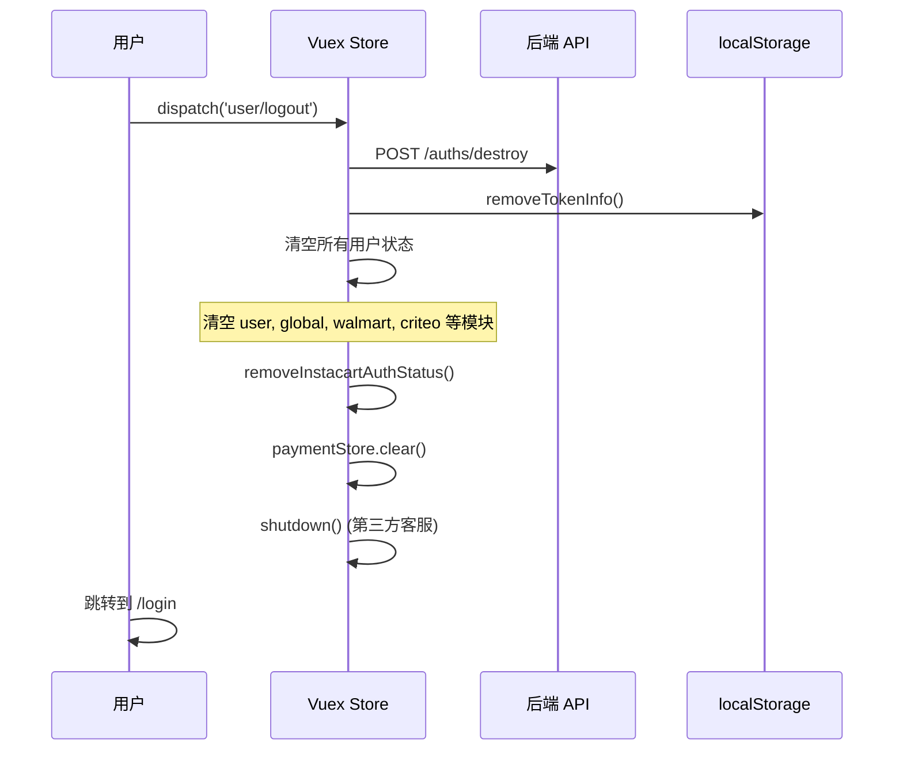

---

## 3. 权限系统

### 3.1 权限模型

系统采用基于权限码 (Permission Code) 的扁平权限模型，不使用传统的 RBAC 角色树。

```mermaid
graph LR
    subgraph 后端
        API_AUTH[/auths GET] -->|返回| CODES[权限码数组<br/>access_action]
    end

    subgraph 前端存储
        CODES --> VUEX_PERM[Vuex: user.permission]
        CODES --> LS_PERM[localStorage: access_action]
    end

    subgraph 权限检查
        VUEX_PERM --> UTIL[utils/permission.js<br/>isPermission / hasPermission]
        VUEX_PERM --> GUARD[路由守卫<br/>meta.key 校验]
        VUEX_PERM --> MENU[菜单渲染<br/>$hasPermission]
        VUEX_PERM --> COMP[组件级控制<br/>v-if / $hasPermission]
    end
```

### 3.2 权限存储

权限码在两个地方存储，互为备份：

1. **Vuex Store** (`store.state.user.permission`) — 运行时主要来源
2. **localStorage** (`access_action`) — 页面刷新后的恢复来源

权限恢复逻辑（在 `permission.js` 路由守卫中）：

```javascript
// 无权限时尝试从 localStorage 恢复
let permissions = store.getters.permission || []
if (permissions.length === 0) {
  const localPermissions = localStorage.getItem('access_action')
  if (localPermissions) {
    permissions = JSON.parse(localPermissions)
    store.commit('user/SET_PERMISSION', JSON.parse(localPermissions))
  }
}
```

### 3.3 权限检查工具

`utils/permission.js` 提供两个核心方法：

```javascript
// 单个权限码检查
isPermission(permissionCode)  // 返回 boolean

// 多个权限码检查（任一匹配即通过）
hasPermission(codes)          // codes: string | string[]，返回 boolean
```

白名单路径（无需权限）：`/custom-board/share`

### 3.4 权限检查层级

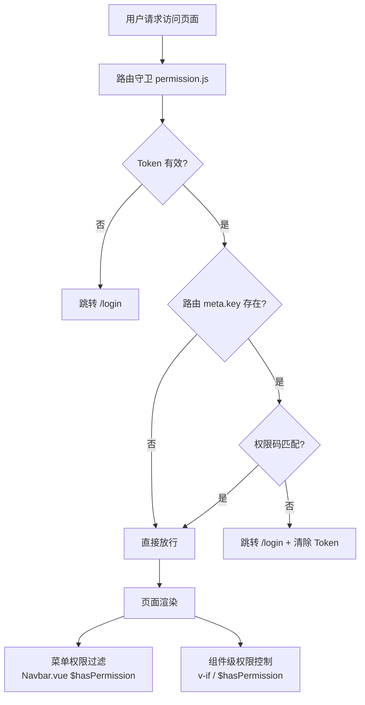

### 3.5 路由级权限 (meta.key)

每个路由可通过 `meta.key` 声明所需权限码：

```javascript
// 单个权限码
{ path: '/home', meta: { key: 'Overview' } }

// 多个权限码（任一匹配即可）
{ path: '/home_new', meta: { key: 'HomePageV2' } }

// 数组形式
{ path: '/some-page', meta: { key: ['Permission1', 'Permission2'] } }
```

### 3.6 菜单级权限

Navbar 组件中，每个菜单项都有 `permission` 字段，通过 `$hasPermission` 过滤：

```javascript
// 菜单定义示例
{
  permission: ['Sponsored_Ads_New_View', 'Portfolios_New_View'],
  icon: 'icon-ads-optimization',
  url: '/allCampaigns/index',
  text: 'route.adOptimize.title',
  submenus: [
    { permission: ['Sponsored_Ads_New_View'], url: '/allCampaigns/index', text: 'route.allCampaigns' },
    { permission: 'Portfolios_New_View', url: '/portfolio_new/index', text: 'route.allPortfolios' }
  ]
}
```

### 3.7 关键权限码一览

| 权限码 | 用途 |
|--------|------|
| `HomePageV2` | 新版首页访问 |
| `Overview` | 旧版首页访问 |
| `Authorize` / `Authorize_Amazon` / `Authorize_Walmart` | 授权管理页面 |
| `Sponsored_Ads_New_View` | 搜索广告查看 |
| `AutomationView` | 自动化规则 |
| `WalmartAdManager_View` | Walmart 广告管理 |
| `GoogleAds` | Google 广告 |
| `AmazonDSP` | Amazon DSP |
| `AMC_ModelGallery` | AMC 模型库 |
| `CNPLGExplore` | 中国 PLG 探索版 |
| `[chat_service]` | 第三方客服 |
| `data_sync` | 数据同步 |

---

## 4. 路由系统

### 4.1 路由架构

```mermaid
graph TB
    subgraph 静态路由 router/index.js
        LOGIN_R[/login]
        REG_R[/register]
        HOME_R[/home_new, /home]
        PROFILE_R[/profileHome, /subAccount]
        SETTINGS_R[/settings]
        AMAZON_R[Amazon 业务路由<br/>allCampaigns, sp, sb, sd, dsp, amc...]
        WALMART_R[/walmart/*]
        CRITEO_R[/criteo/*]
        SHARE_R[/custom-board/share]
        ERR_R[/404, /401]
    end

    subgraph 动态路由 router.addRoute
        INSTACART_R[/instacart/*<br/>Instacart platformConfig.install]
        CITRUSAD_R[/citrusAd/*<br/>CitrusAd platformConfig.install]
    end

    subgraph 路由守卫 permission.js
        BEFORE[beforeEach]
        AFTER[afterEach]
    end

    BEFORE --> LOGIN_R
    BEFORE --> HOME_R
    BEFORE --> AMAZON_R
    BEFORE --> WALMART_R
    BEFORE --> CRITEO_R
    BEFORE --> INSTACART_R
    BEFORE --> CITRUSAD_R
```

### 4.2 路由白名单

以下路径不需要认证即可访问：

```javascript
const whiteList = [
  '', '/', '/login', '/auth-redirect', '/register',
  '/cn/register', '/register-finish', '/forgetPassword',
  '/website', '/website-consult', '/custom-board/share'
]
```

### 4.3 路由守卫流程 (beforeEach)

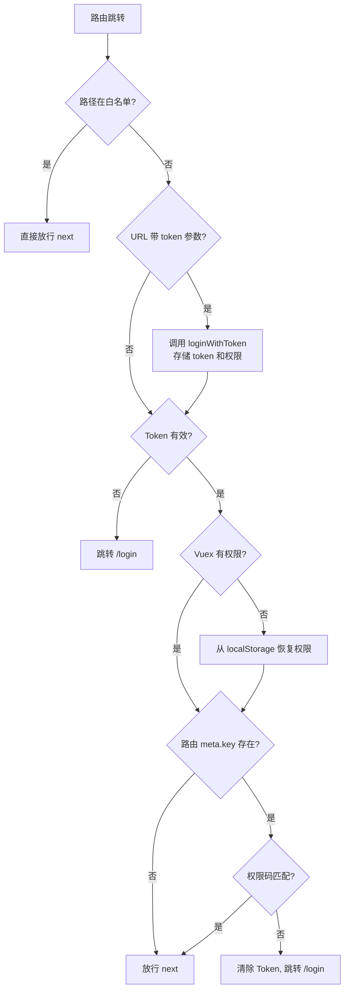

### 4.4 路由守卫流程 (afterEach)

afterEach 负责以下工作：

1. **GA 埋点** — `gtag('event', 'page_view', ...)`
2. **进度条结束** — `NProgress.done()`
3. **面包屑更新** — `store.commit('router/SET_BREADCRUMBS', ...)`
4. **DSP 页面检测** — `store.commit('global/detectDspPage', to)`
5. **平台自动切换** — 根据 URL 路径前缀自动切换当前平台
6. **公告消息** — 特定路由显示下线/升级提示
7. **URL token 清理** — 移除 URL 中的 token 参数

### 4.5 平台路由自动检测

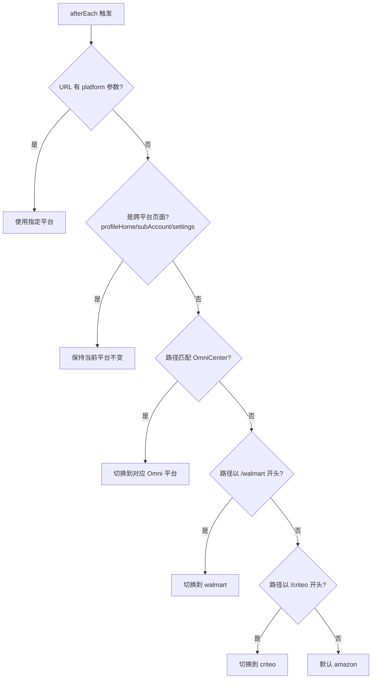

跨平台页面列表：
```javascript
const crossPlatformPages = ['/profileHome', '/subAccount', '/settings/index']
```

### 4.6 路由结构

| 平台 | 路由前缀 | 注册方式 | 路由文件 |
|------|----------|----------|----------|
| Amazon | `/` (根路径) | 静态注册 | `router/modules/*.js` |
| Walmart | `/walmart` | 静态注册 | `router/walmart/index.js` |
| Criteo | `/criteo` | 静态注册 | `router/criteo/index.js` |
| Instacart | `/instacart` | 动态注册 (`router.addRoute`) | `omni/instacart/route/index.js` |
| CitrusAd | `/citrusAd` | 动态注册 (`router.addRoute`) | `omni/citrusAd/route/index.js` |

### 4.7 Layout 结构

所有需要认证的页面都使用 `Layout` (`layout/main/index.vue`) 作为父组件：

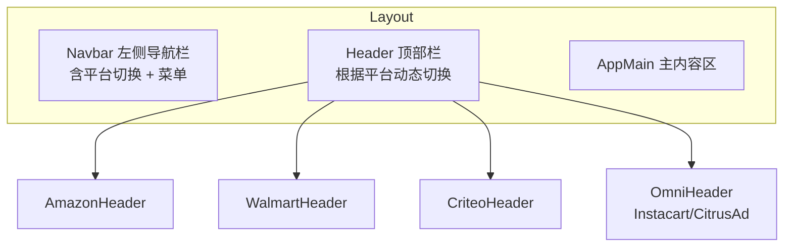

---

## 5. 账号系统

### 5.1 账号层级模型

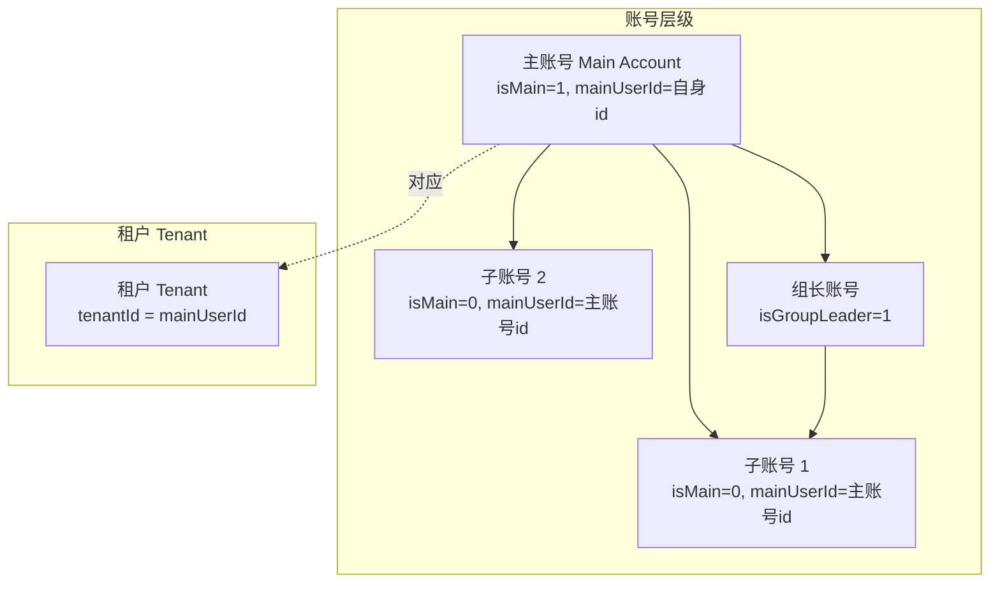

### 5.2 用户属性

用户信息存储在 `Vuex store.state.user` 中：

| 字段 | 类型 | 说明 |
|------|------|------|
| `id` | number | 用户 ID |
| `uid` | string | 用户唯一标识 |
| `name` | string | 用户名 |
| `email` | string | 邮箱 |
| `isAdmin` | number | 是否管理员 (0/1) |
| `isMain` | number | 是否主账号 (0/1) |
| `mainUserId` | number | 对应主账号 ID |
| `userType` | string | 用户类型 |
| `businessType` | string | 业务类型 (1=国内, 2=海外) |
| `businessVersion` | string | 版本 ([version_tier_1]/[version_tier_2]/[version_tier_3]/[version_tier_4]/[version_tier_5]) |
| `sourceChannel` | string | 来源渠道 (4=[partner_name]) |
| `roles` | array | 角色 ID 列表 (mainRoleIds) |
| `permission` | array | 权限码列表 |
| `isAsinSkip` | boolean | 是否走 ASIN 分权限逻辑 |
| `asinAuthMode` | number | ASIN 分权限模式 (-1主账号, 0宽松, 1不隔离, 2严格) |
| `isGroupLeader` | number | 是否组长 |
| `isAgency` | string | 是否代理商 |

### 5.3 多租户 (Multi-Tenant) 机制

```mermaid
flowchart TD
    A[用户登录] --> B[Layout.init]
    B --> C[initUserInfo<br/>获取用户信息]
    C --> D[initPlatform]
    D --> E[initAccounts<br/>获取租户列表]
    E --> F{isMultiAccount?}
    F -->|否| G[tenantId = mainUserId<br/>使用自身主账号]
    F -->|是| H{URL 有 tenantId?}
    H -->|是| I[使用 URL tenantId]
    H -->|否| J{缓存有 tenantId?}
    J -->|是| K[使用缓存 tenantId]
    J -->|否| L{是管理员?}
    L -->|是| M[默认 [default_tenant_id] (demo)]
    L -->|否| N[使用账号列表第一个]
```

租户 ID 在不同平台有独立存储：

| 平台 | Vuex 字段 | URL 参数 | 缓存方式 |
|------|-----------|----------|----------|
| Amazon | `global.tenantId` | `tenantId` | sessionStorage |
| Walmart | `global.walmartTenantId` | `walmartTenantId` | localStorage |
| Criteo | `global.criteoTenantId` | `criteoTenantId` | sessionStorage |
| Omni (Instacart/CitrusAd) | `OmniCenter.curTenantId` | `tenantId` | sessionStorage |

### 5.4 子账号管理

子账号管理页面 (`/subAccount`) 的功能：

- **主账号视角**：可查看/创建/编辑/删除子账号，分配资源权限
- **组长视角**：可管理组内子账号
- **子账号视角**：只能查看自己的资源权限

相关 API：

| API | 方法 | 说明 |
|-----|------|------|
| `/v1/users` | GET | 获取账号列表 |
| `/v1/users` | POST | 创建子账号 |
| `/v1/users/:id` | PUT | 更新子账号 |
| `/v1/users/:id` | DELETE | 删除子账号 |
| `/v3/resource/assign-all` | POST | 分配资源权限 |

### 5.5 ASIN 分权限

系统支持基于 ASIN 的细粒度权限控制：

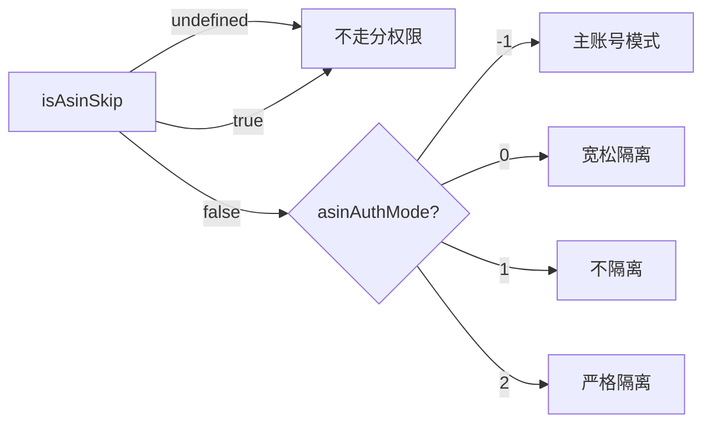

ASIN 分权限标志通过 HTTP 请求头 `isAsinSkip` 传递给后端。

---

## 6. 平台系统

### 6.1 平台架构总览

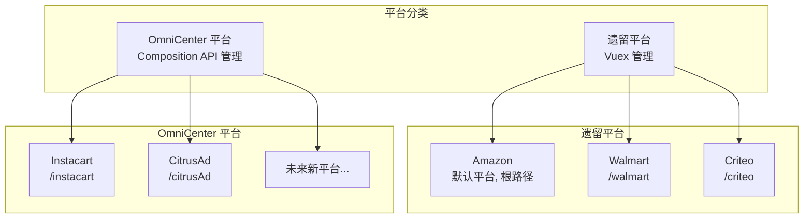

### 6.2 平台状态管理对比

| 特性 | 遗留平台 (Amazon/Walmart/Criteo) | OmniCenter 平台 (Instacart/CitrusAd) |
|------|----------------------------------|---------------------------------------|
| 状态管理 | Vuex modules | Composition API reactive |
| 路由注册 | 静态 (router/index.js) | 动态 (router.addRoute) |
| 初始化 | `global.initPlatform` dispatch | `OmniCenter.switchPlatform()` |
| 租户管理 | 各平台独立字段 | 统一 `curTenantId` |
| 店铺管理 | 各平台独立 store | 统一 `curProfileIds` |
| 菜单定义 | Navbar.vue 内联 | platformConfig.menus 函数 |
| Header | 各平台独立组件 | platformConfig.renderHeader |

### 6.3 OmniCenter 架构

OmniCenter 是新一代平台管理框架，使用 Composition API 构建：

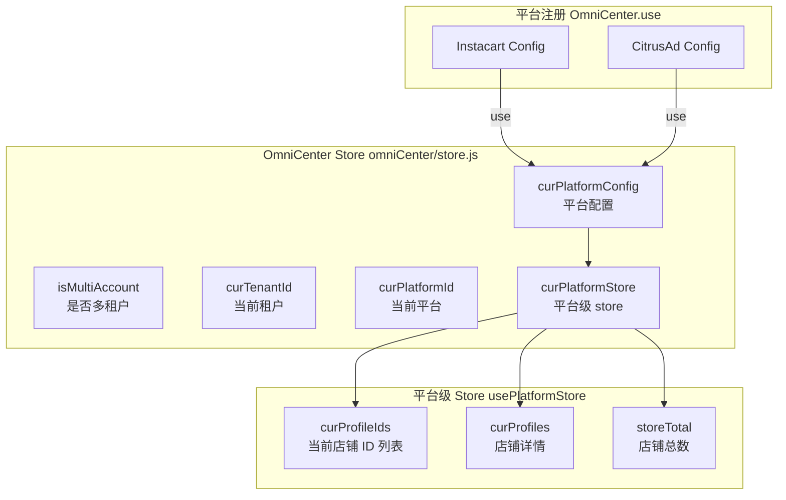

### 6.4 平台配置 (platformConfig)

每个 OmniCenter 平台需要提供一个配置对象：

```javascript
// omni/instacart/platformConfig.js 示例
export default {
  id: 'instacart',              // 平台 ID，也是路由前缀
  name: 'Instacart',            // 显示名称
  icon: svgIcon,                // 图标
  permission: undefined,        // 访问权限码 (undefined = 无限制)
  menus: getInstacartMenus,     // 菜单生成函数
  profiles: {
    list: getInstacartStore,    // 获取店铺列表 API
    getById: getInstacartStoreById  // 根据 ID 获取店铺 API
  },
  renderHeader: h => h(InstacartHeader),  // Header 渲染函数
  supportLanguages: ['en'],     // 支持的语言
  supportCurrencies: ['USD'],   // 支持的货币
  install() {                   // 安装钩子
    router.addRoute(instacartRoute)  // 动态注册路由
    eventBus.$on('loginSuccess', () => {
      checkInstacartAuth()      // 登录后检查授权
    })
  }
}
```

### 6.5 平台切换流程

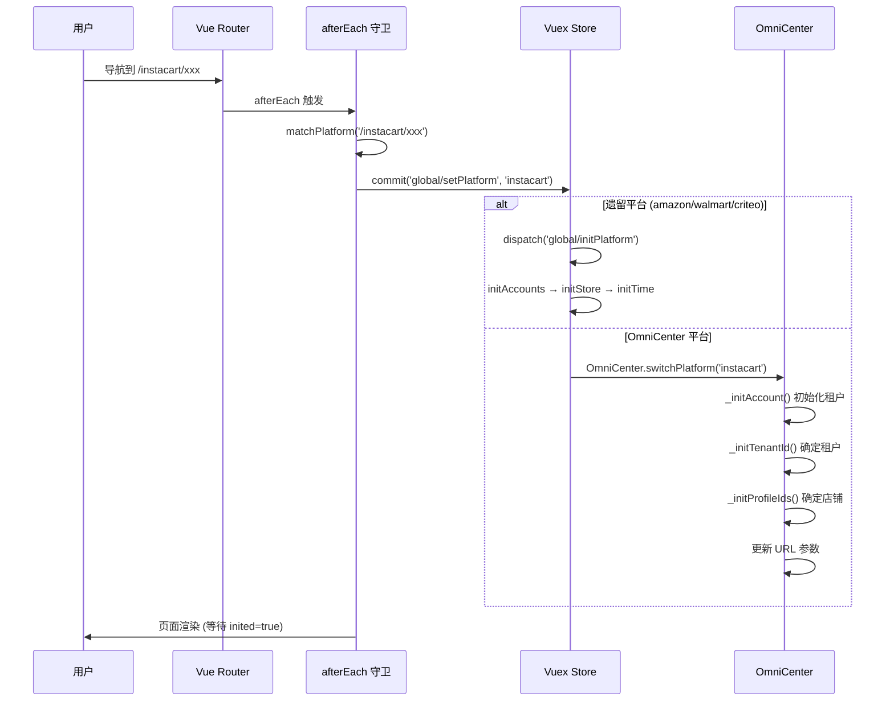

### 6.6 HTTP 请求拦截器中的平台处理

`utils/request.js` 的请求拦截器会根据当前平台自动设置请求头：

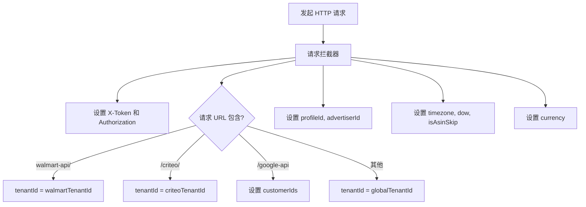

### 6.7 各平台 Vuex Store 模块

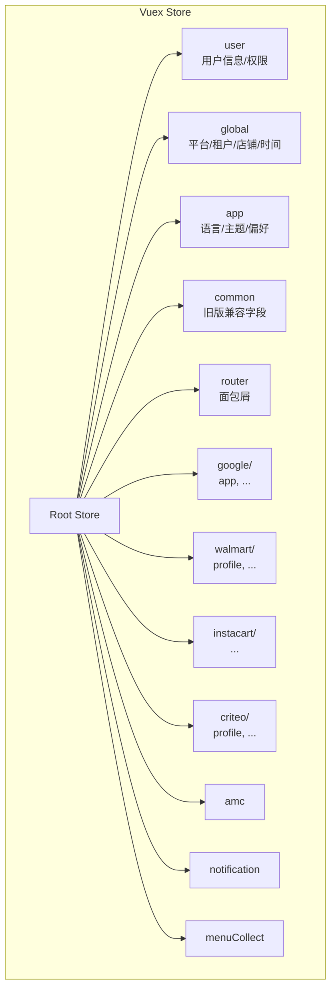

---

## 7. 模块间关系图

### 7.1 五大模块完整交互图

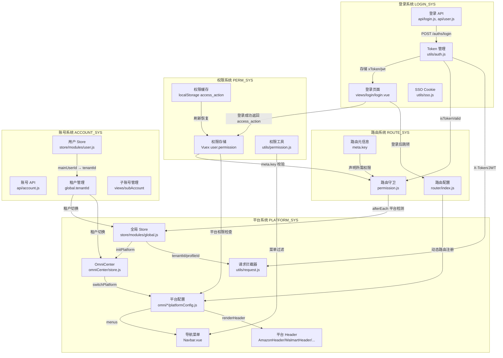

### 7.2 用户完整生命周期

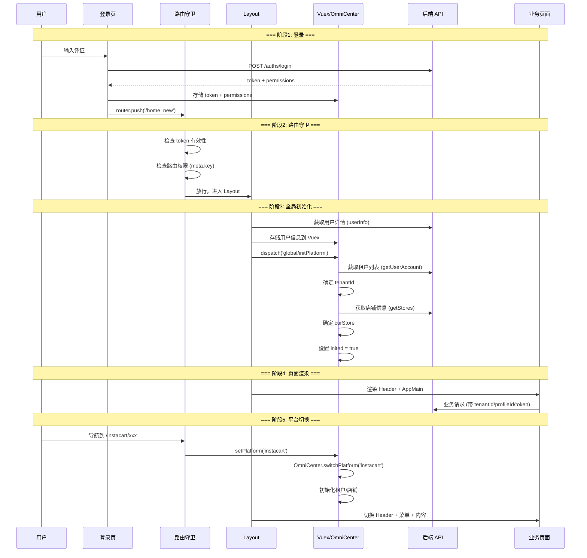

### 7.3 数据流向图

```mermaid
flowchart LR
    subgraph 后端
        AUTH_API[认证服务<br/>/auths]
        USER_API[用户服务<br/>/v1/users]
        PROFILE_API[店铺服务<br/>/v2/sellers]
        BIZ_API[业务服务<br/>各平台 API]
    end

    subgraph 前端存储
        LS[localStorage<br/>token + permissions]
        SS[sessionStorage<br/>tenantId + stores]
        COOKIE[Cookie<br/>SSO token]
        VUEX[Vuex Store<br/>运行时状态]
        OMNI_S[OmniCenter<br/>reactive state]
    end

    subgraph 前端消费
        GUARD_C[路由守卫]
        MENU_C[菜单渲染]
        HEADER_C[Header 组件]
        REQ_C[请求拦截器]
        PAGE_C[业务页面]
    end

    AUTH_API --> LS
    AUTH_API --> VUEX
    USER_API --> VUEX
    PROFILE_API --> VUEX
    PROFILE_API --> OMNI_S

    LS --> GUARD_C
    LS --> VUEX
    SS --> VUEX
    COOKIE --> AUTH_API
    VUEX --> MENU_C
    VUEX --> HEADER_C
    VUEX --> REQ_C
    OMNI_S --> HEADER_C
    OMNI_S --> REQ_C
    REQ_C --> BIZ_API
    BIZ_API --> PAGE_C
```

---

## 8. 关键文件索引

| 模块 | 文件 | 职责 |
|------|------|------|
| 登录 | `views/login/login.vue` | 登录页面 UI 和逻辑 |
| 登录 | `api/login.js` | 登录/免登录 API |
| 登录 | `api/user.js` | 用户注册/登出/密码/验证码 API |
| 登录 | `utils/auth.js` | Token 读写和校验 |
| 登录 | `utils/sso.js` | SSO Cookie 管理 |
| 权限 | `utils/permission.js` | 权限检查工具函数 |
| 权限 | `store/modules/user.js` | 用户状态和权限存储 |
| 路由 | `router/index.js` | 路由配置和注册 |
| 路由 | `permission.js` | 路由守卫 (beforeEach/afterEach) |
| 路由 | `router/modules/*.js` | Amazon 各模块路由 |
| 路由 | `router/walmart/index.js` | Walmart 路由 |
| 路由 | `router/criteo/index.js` | Criteo 路由 |
| 账号 | `api/account.js` | 账号 CRUD API |
| 账号 | `views/subAccount/index.vue` | 子账号管理页面 |
| 账号 | `views/profile/index.vue` | 授权管理页面 (店铺绑定) |
| 账号 | `api/profile.js` | 店铺/授权 API |
| 平台 | `store/modules/global.js` | 全局状态 (平台/租户/店铺/时间) |
| 平台 | `omniCenter/store.js` | OmniCenter 状态管理 |
| 平台 | `omniCenter/index.js` | OmniCenter 入口和平台匹配 |
| 平台 | `omniCenter/utils.js` | URL 参数同步工具 |
| 平台 | `omni/instacart/platformConfig.js` | Instacart 平台配置 |
| 平台 | `omni/citrusAd/platformConfig.js` | CitrusAd 平台配置 |
| 平台 | `layout/main/index.vue` | 主布局 (初始化入口) |
| 平台 | `layout/main/components/Navbar.vue` | 导航菜单 |
| 平台 | `utils/request.js` | HTTP 请求拦截器 |
| 平台 | `store/getters/index.js` | Vuex 全局 getters |
