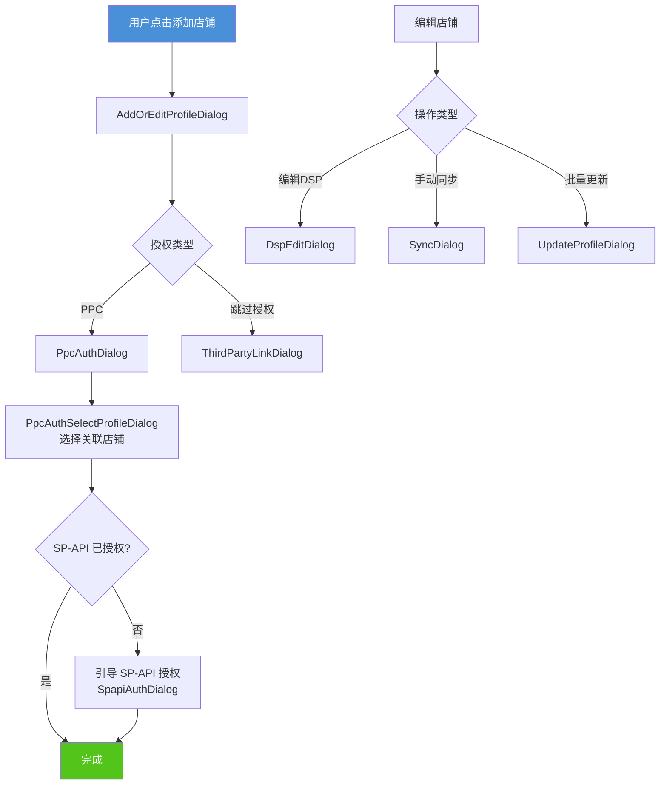
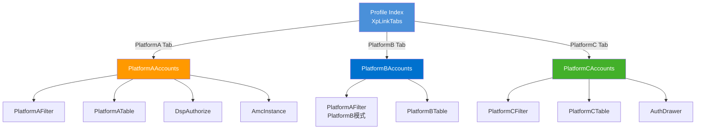
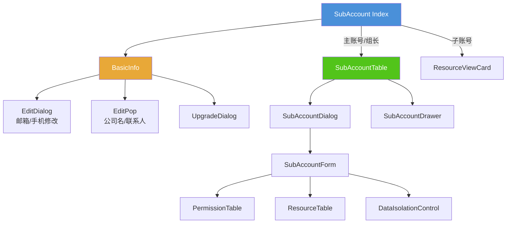
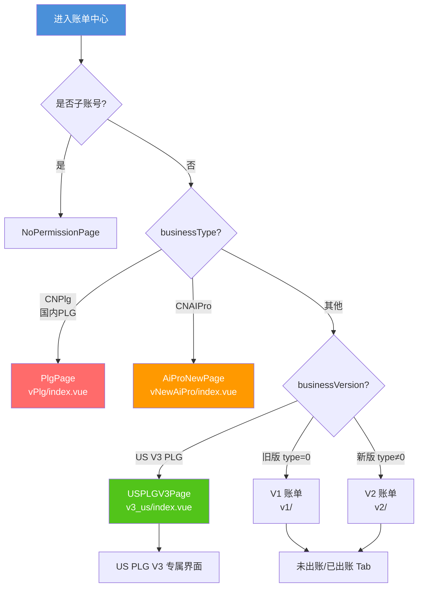
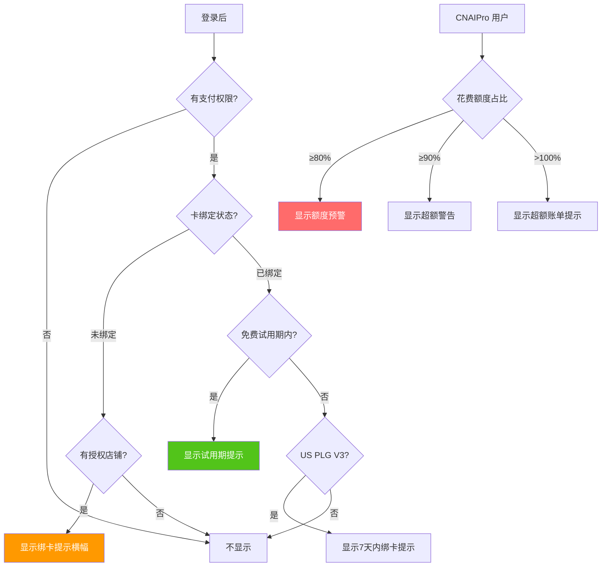
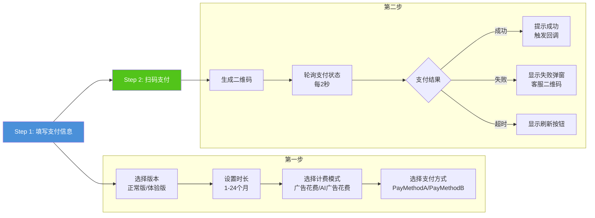
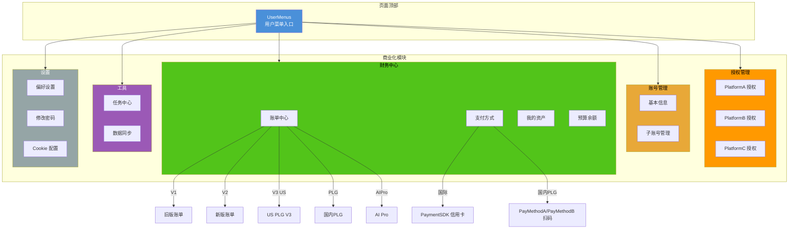

# [ProductName] 商业化模块文档

## 1. 模块概述

商业化模块是 [ProductName] 系统中负责用户账号管理、店铺授权、财务计费、支付结算等核心商业功能的模块集合。该模块从用户菜单（UserMenus）入口出发，涵盖以下子模块：

| 子模块 | 路由路径 | 权限标识 | 说明 |
|--------|----------|----------|------|
| 授权管理 (Profile) | `/profileHome` | `Authorize` | 多平台店铺授权与管理 |
| 账号管理 (SubAccount) | `/subAccount` | - | 账号信息、子账号管理 |
| 账单中心 (BillingCenter) | `/Financial/billingCenter` | `BillInquire` | 多版本账单查询 |
| 我的资产 (MyAssets) | `/Financial/myAssets` | `Voucher` | 抵用券/优惠券管理 |
| 支付方式 (Payment) | `/Financial/payment` | `UserPayment` | 信用卡绑定与管理 |
| 预算与余额 (Budget) | `/Financial/budget` | `BudgetandBalance` | DSP 预算与余额查看 |
| 任务中心 (AsyncTaskCenter) | `/asyncTaskCenter` | `Task_Center` | 批量任务与数据导出 |
| 数据同步 (DataSync) | `/dataSync` | `data_sync` | [PlatformA] 数据同步状态 |
| 偏好设置 (UserPreferences) | `/settings` | `Notification` | 货币/语言/日期格式等 |

---

## 2. 模块入口：UserMenus 用户菜单

**文件位置**: `src/layout/main/components/header/components/UserMenus.vue`

UserMenus 是整个商业化模块的统一入口，以 Dropdown 下拉菜单形式挂载在页面顶部 Header 右侧。

### 2.1 菜单结构

```
┌─────────────────────────────┐
│ [头像] 用户名    [账号管理]  │
├─────────────────────────────┤
│ 🔑 授权管理                  │
│ 💰 账单中心          ▶      │
│    ├─ 账单查询               │
│    ├─ 我的资产               │
│    ├─ 支付方式               │
│    └─ 预算与余额             │
│ 📋 任务中心                  │
│ 🔄 数据同步 (仅[PlatformA]) │
├─────────────────────────────┤
│ 偏好                        │
│ [货币选择]  [语言选择]       │
│ 更多设置                    │
├─────────────────────────────┤
│ 🍪 Cookie 自定义配置        │
│ 🔒 修改密码                 │
│ 🚪 登出                     │
└─────────────────────────────┘
```

### 2.2 菜单项配置

| 菜单项 | 权限 | 可见条件 | 跳转目标 |
|--------|------|----------|----------|
| 授权管理 | `Authorize` | 默认显示 | `profile` 页面 |
| 账单中心 | `BillCenter` / `BillInquire` (V3) | `sourceChannel !== 4` | V3: `billingCenter`; 非V3: 展开子菜单 |
| 任务中心 | `Task_Center` | `sourceChannel !== 4` | `asyncTaskCenter` |
| 数据同步 | `data_sync` | 仅 `platform === '[platformA]'` | `dataSync` |
| Cookie 配置 | 无 | 默认显示 | 调用 `CookieConsent.showPreferences()` |
| 修改密码 | 无 | `sourceChannel !== 4` | 打开 `ChangePasswordDialog` |
| 登出 | 无 | 默认显示 | 执行 logout 流程 |

### 2.3 偏好设置区域

偏好设置区域内嵌在菜单中，包含：

- **货币选择**: 根据平台动态渲染不同组件
  - [PlatformA]: `CurrencySelectPlatformAInUserMenus` (新/旧版)
  - [PlatformB]: `CurrencySelectPlatformBInUserMenus`
  - [PlatformD]: `CurrencySelectPlatformDInUserMenus`
  - Omni 平台: `OmniCurrencySelect`
- **语言选择**: `LanguageSelectInUserMenus` / `OmniLanguageSelect`
- **更多设置**: 跳转到 `/settings` 页面

### 2.4 Mermaid 架构图：UserMenus 组件依赖

```mermaid
graph TD
    UM[UserMenus.vue] --> CPD[ChangePasswordDialog.vue]
    UM --> XPL[XpLink]
    UM --> XPE[XpEllipsisText]
    UM --> UP[UserPreferences.vue]
    
    UM --> CSA_NEW[CurrencySelectPlatformAInUserMenus_new.vue]
    UM --> CSA[CurrencySelectPlatformAInUserMenus.vue]
    UM --> CSW[CurrencySelectPlatformBInUserMenus.vue]
    UM --> CSC[CurrencySelectPlatformDInUserMenus.vue]
    UM --> OCS[OmniCurrencySelect.vue]
    
    UM --> LS[LanguageSelectInUserMenus.vue]
    UM --> OLS[OmniLanguageSelect.vue]
    
    style UM fill:#4A90D9,color:#fff
    style CPD fill:#E8A838,color:#fff
    style UP fill:#E8A838,color:#fff
```



---

## 3. 授权管理模块 (Profile)

**路由**: `/profileHome`  
**权限**: `Authorize`  
**入口文件**: `src/views/profile/index.vue`

### 3.1 模块结构

授权管理模块通过 Tab 页签切换支持多平台店铺管理：

| Tab | 权限 | 组件 |
|-----|------|------|
| [PlatformA] | `Authorize_PlatformA` | `PlatformAAccounts.vue` |
| [PlatformB] | `Authorize_PlatformB` | `PlatformBAccounts.vue` |
| [PlatformC] | 无 (默认显示) | `PlatformCAccounts.vue` |

### 3.2 [PlatformA] 授权管理

**文件**: `src/views/profile/[platformA]/PlatformAAccounts.vue`

[PlatformA] 授权管理是最复杂的平台授权模块，包含三个子 Tab：

| 子Tab | 权限 | 说明 |
|-------|------|------|
| 店铺授权 | `AuthorizeView` | PPC/SP-API 店铺授权管理 |
| DSP 授权 | `DSP_Authorization_Visible` | DSP 广告主授权 |
| AMC 实例授权 | `AMC_Instance_Authorization` | AMC 实例管理 |

#### 核心功能流程

1. **添加店铺**: 打开 `AddOrEditProfileDialog` → PPC 授权 → SP-API 授权
2. **编辑店铺**: 修改店铺信息、DSP 广告主配置
3. **PPC 授权**: `PpcAuthDialog` → `PpcAuthSelectProfileDialog` (选择关联店铺)
4. **SP-API 授权**: `SpapiAuthDialog` 引导用户完成 [PlatformA] SP-API 授权
5. **手动同步**: `SyncDialog` 触发数据同步
6. **批量更新**: `UpdateProfileDialog` 批量更新店铺信息
7. **新手引导**: `NoviceGuideDialog` (仅中国区用户首次访问)

#### Mermaid 流程图：[PlatformA] 授权流程



#### [PlatformA] 授权组件清单

| 组件 | 文件 | 功能 |
|------|------|------|
| PlatformAFilter | `PlatformAFilter.vue` | 筛选：关键词/区域/国家/PPC状态/SP-API状态 |
| PlatformATable | `PlatformATable.vue` | 店铺列表表格 |
| AddOrEditProfileDialog | `AddOrEditProfileDialog.vue` | 添加/编辑店铺弹窗 |
| PpcAuthDialog | `PpcAuthDialog.vue` | PPC 授权弹窗 |
| PpcAuthSelectProfileDialog | `PpcAuthSelectProfileDialog.vue` | PPC 授权后选择店铺 |
| SpapiAuthDialog | `SpapiAuthDialog.vue` | SP-API 授权弹窗 |
| DspEditDialog | `DspEditDialog.vue` | DSP 广告主编辑 |
| DspEditAdvertiserSelect | `DspEditAdvertiserSelect.vue` | DSP 广告主选择器 |
| SyncDialog | `SyncDialog.vue` | 手动同步数据弹窗 |
| UpdateProfileDialog | `UpdateProfileDialog.vue` | 批量更新店铺弹窗 |
| NoviceGuideDialog | `NoviceGuideDialog.vue` | 新手引导弹窗 |
| CountryAuthLayout | `CountryAuthLayout.vue` | 国家授权布局 |
| CountryListCell | `CountryListCell.vue` | 国家列表单元格 |
| CountryListEdit | `CountryListEdit.vue` | 国家列表编辑 |
| composables.js | `composables.js` | 授权相关组合式函数 |
| columns.js | `columns.js` | 表格列定义 |

#### AMC 子模块

| 组件 | 说明 |
|------|------|
| DspAuthorize | DSP 授权管理页面 |
| AmcInstance | AMC 实例授权管理页面 |
| SelectDspAdvertiser | DSP 广告主选择弹窗 |

### 3.3 [PlatformB] 授权管理

**文件**: `src/views/profile/[platformB]/PlatformBAccounts.vue`

| 组件 | 功能 |
|------|------|
| PlatformBAccounts | 主容器，管理筛选/表格/弹窗状态 |
| PlatformBTable | 店铺列表表格 |
| AddOrEditProfileDialog | 添加/编辑 [PlatformB] 店铺 |
| ProfileAuthorizationDialog | [PlatformB] PPC 授权弹窗 |

#### 核心流程
1. 添加店铺 → `AddOrEditProfileDialog` (step 1)
2. 编辑店铺 → `AddOrEditProfileDialog` (step 2)
3. 授权重试 → 调用 `updatePlatformBProfileAuthInfo` API

### 3.4 [PlatformC] 授权管理

**文件**: `src/views/profile/[platformC]/PlatformCAccounts.vue`

| 组件 | 功能 |
|------|------|
| PlatformCAccounts | 主容器 |
| PlatformCFilter | 筛选：关键词/账号/国家/授权状态 |
| PlatformCTable | 店铺列表表格 |
| AuthDrawer | 授权抽屉 (create/edit/retry) |
| EditAdvertiserDialog | 编辑广告主弹窗 (已授权状态) |
| AuthDocGuide | 授权文档引导 |
| composables.js | 组合式函数 |
| columns.js | 表格列定义 |

#### 特殊逻辑
- 支持 OAuth 回调处理：页面挂载时检查 URL 中的 `code` 和 `auth_id` 参数
- 编辑操作根据授权状态分流：已授权 → 弹窗编辑；未授权 → 抽屉编辑

### 3.5 Mermaid 架构图：授权管理模块



---

## 4. 账号管理模块 (SubAccount)

**路由**: `/subAccount`  
**入口文件**: `src/views/subAccount/index.vue`

### 4.1 模块结构

账号管理页面根据用户角色展示不同内容：

| 角色 | 展示内容 |
|------|----------|
| 主账号 (isMain) | BasicInfo + SubAccountTable |
| 组长 (isGroupLeader) | BasicInfo + SubAccountTable |
| 子账号 | BasicInfo + ResourceViewCard (只读) |
| sourceChannel === 4 | 所有编辑功能禁用 |

### 4.2 BasicInfo 基本信息

**文件**: `src/views/subAccount/components/BasicInfo.vue`

展示并管理账号基本信息：

| 信息项 | 可编辑 | 说明 |
|--------|--------|------|
| 版本徽章 | 否 | 显示 businessVersion (如 CNProfessional) |
| 邮箱 | 是 | 通过 `EditDialog` 修改，需验证码 |
| 手机号 | 是 | 通过 `EditDialog` 修改，需验证码 |
| 公司名称 | 是 | 通过 `Popover` 内联编辑 |
| 联系人 | 是 | 通过 `Popover` 内联编辑 |
| 有效期 | 否 | 国内版显示到期日，国际版显示"永久" |
| AI 有效期 | 否 | 仅 CNProfessional 版本显示 |
| 账号状态 | 否 | 正常/不可用 |
| 是否主账号 | 否 | 是/否 |

### 4.3 SubAccountTable 子账号管理

**文件**: `src/views/subAccount/components/table/`

| 组件 | 功能 |
|------|------|
| index.vue | 子账号列表主表格 |
| SubAccountDialog.vue | 添加/编辑子账号弹窗 |
| SubAccountDrawer.vue | 子账号详情抽屉 |
| SubAccountForm.vue | 子账号表单 |
| PermissionTable.vue | 权限配置表格 |
| ResourceTable.vue | 资源分配表格 |
| ProfileFilter.vue | 店铺筛选器 |
| PlatformAShopDialog.vue | [PlatformA] 店铺选择弹窗 |
| OperationCheckGroup.vue | 操作权限勾选组 |
| OperationGroupDialog.vue | 操作组弹窗 |
| DataIsolationControl.vue | 数据隔离控制 |
| columns.js | 表格列定义 |
| utils.js | 工具函数 |

### 4.4 其他组件

| 组件 | 功能 |
|------|------|
| ResourceViewCard | 子账号查看自身资源分配 |
| UpgradeDialog | 版本升级弹窗 |
| BatchUpload/ | 批量上传子账号 |
| ResourceViewer/ | 资源查看器 |

### 4.5 Mermaid 架构图：账号管理模块



---

## 5. 财务模块 (Financial)

**路由前缀**: `/Financial`  
**入口文件**: `src/views/financial/`

### 5.1 账单中心 (BillingCenter)

**路由**: `/Financial/billingCenter`  
**权限**: `BillInquire`  
**入口文件**: `src/views/financial/billingCenter/index.vue`

账单中心是最复杂的财务子模块，根据用户的 `businessType` 和 `businessVersion` 动态渲染不同版本的账单页面。

#### 版本路由逻辑



#### 账单版本对照表

| 版本 | 目录 | 适用场景 | 主要功能 |
|------|------|----------|----------|
| V1 | `v1/` | 旧版国际用户 (businessType=0) | 未出账/已出账 Tab + 账单详情 |
| V2 | `v2/` | 新版国内/国际用户 | 未出账/已出账 Tab + 折扣横幅 + 账单详情 |
| V3 US PLG | `v3_us/` | 美国 PLG V3 用户 | 账单表格 + 账单详情 + 切换套餐 |
| PLG | `vPlg/` | 国内 PLG (CNSS) 用户 | 续费 + 版本升级 |
| AI Pro | `vAiPro/` | 旧版 AI Pro 用户 | (已废弃，使用 vNewAiPro) |
| New AI Pro | `vNewAiPro/` | CNAIPro 用户 | 新版 AI Pro 账单 |

#### 账单中心组件清单

| 组件/目录 | 功能 |
|-----------|------|
| `components/datePicker.vue` | 日期选择器 |
| `components/filter.vue` | 筛选器 |
| `components/selectProfile.vue` | 店铺选择 |
| `components/productCard.vue` | 产品卡片 |
| `components/portfolios.vue` | Portfolio 选择 |
| `components/aiTable/` | AI 账单表格 |
| `components/monthTable/` | 月度账单表格 |
| `components/taskTable/` | 任务账单表格 |
| `pricing.vue` | 定价页面 (套餐切换) |

#### 账单中心路由表

| 路由名 | 路径 | 说明 |
|--------|------|------|
| billingCenter | `/Financial/billingCenter` | 账单中心首页 |
| outDetailV1 | `/billingCenter/v1/outDetail` | V1 已出账详情 |
| outDetailV2 | `/billingCenter/v2/outDetail` | V2 已出账详情 |
| unBilledDetailV2 | `/billingCenter/v2/unBilledDetail` | V2 未出账详情 |
| UsV3BillingDetail | `/billingCenter/v3/us-billing-detail` | US V3 账单详情 |
| pricing | `/billingCenter/pricing` | 定价/套餐切换 |
| upgrade | `/billingCenter/upgrade` | PLG 版本升级 |
| renewal | `/billingCenter/renewal` | PLG 续费 |
| USPLGSwitchPlan | `/billingCenter/us-plg-switch-plan` | US PLG 切换套餐 |

### 5.2 支付方式 (Payment)

**路由**: `/Financial/payment`  
**权限**: `UserPayment`  
**入口文件**: `src/views/financial/payment/`

#### 支付模块结构

| 组件/文件 | 功能 |
|-----------|------|
| `index/index.js` | 支付方式首页 (信用卡列表) |
| `index/useCheckAccount.js` | 账号检查 Hook |
| `index/useBindCardSuccessCallback.js` | 绑卡成功回调 |
| `addCard/addCard.js` | 添加/编辑信用卡 |
| `addCard/usePaymentSDKElements.js` | [PaymentSDK] Elements 集成 |
| `BillUnPaidDialog.vue` | 未支付账单弹窗 |
| `CreditPromptDialog.vue` | 信用卡绑定提示弹窗 |
| `CreditPromptDialog2.vue` | 信用卡绑定提示弹窗 V2 |
| `PayBillDialog.vue` | 支付账单弹窗 |
| `USPLGPaymentDialog/` | US PLG 支付弹窗 ([PaymentSDK]) |
| `store.js` | 支付状态管理 (Vue 实例) |
| `paymentError.js` | 支付错误处理 |
| `waitForStore.js` | 等待 Store 初始化 |

#### Payment Store 核心状态

`store.js` 使用独立的 Vue 实例作为状态管理：

| 状态 | 类型 | 说明 |
|------|------|------|
| cardBindingStatus | Number | 信用卡绑定状态: 0-未绑定, 1-已绑定, 2-无需绑定 |
| businessVersion | String | 用户版本 (GlobalExploreV3, GlobalScaleV3, CNAIPro 等) |
| businessType | Number | 1-国内用户, 2-国际用户 |
| accountPayStatus | Number | 9-试用, 1-正式, 2-过期 |
| freeTrialExpireDate | String | 免费试用到期时间 |
| profileEmpty | Boolean | 是否有已授权店铺 |
| profileCount | Number | 绑定店铺数量 |
| isYearPaid | Number | 是否年费用户 |
| spendThreshold | Number | 广告花费额度占比 |

#### 支付提示逻辑

Payment Store 包含多种横幅提示逻辑：



### 5.3 PLG 支付模块

**文件**: `src/views/financial/plg/`

PLG (Product-Led Growth) 支付模块专为国内 PLG 用户设计，支持 [PayMethodA]/[PayMethodB] 扫码支付。

| 组件 | 功能 |
|------|------|
| `payment.vue` | PLG 支付主页面 (两步流程) |
| `PaymentDetailCard.vue` | 支付详情卡片 |
| `addCM.vue` | 添加客户经理 |
| `staticAddCM.vue` | 静态客户经理页面 |
| `composables.js` | 客服二维码生成 |

#### PLG 支付流程



#### PLG 计费模式

| 模式 | 权限 | 说明 |
|------|------|------|
| 按广告花费 (paymentMode=1) | `PLG_billed_by_Ad_spend` | 按总广告花费额度计费 |
| 按AI广告花费 (paymentMode=2) | `PLG_billed_by_AI_spend` | 按AI托管广告花费计费 |

### 5.4 我的资产 (MyAssets)

**路由**: `/Financial/myAssets`  
**权限**: `Voucher`  
**入口文件**: `src/views/financial/myAssets/index_new.vue`

| 组件 | 功能 |
|------|------|
| `index_new.vue` | 资产页面主入口 (新版) |
| `VoucherAmount.vue` | 抵用券余额展示 |
| `VoucherHistoryTable.vue` | 抵用券使用历史表格 |
| `old/index.vue` | 旧版资产页面 |
| `column.js` | 表格列定义 |
| `utils.js` | 工具函数 (含 useCheckAccount) |

页面根据账号类型分流：
- 子账号 → `NoPermissionPage`
- 新版账号 → Tab 切换 (AI 抵用券) + 余额 + 历史记录
- 旧版账号 → `VoucherOldPage`

### 5.5 预算与余额 (Budget)

**路由**: `/Financial/budget`  
**权限**: `BudgetandBalance`  
**入口文件**: `src/views/financial/budget/index.vue`

仅对 DSP 类型店铺或 SP+DSP 混合店铺可见，展示：
- 本月预算金额
- 预算执行率 (进度条)
- 账户余额

---

## 6. 任务中心 (AsyncTaskCenter)

**路由**: `/asyncTaskCenter`  
**权限**: `Task_Center`  
**入口文件**: `src/views/asyncTaskCenter/index.vue`

### 6.1 模块结构

任务中心通过 Tab 页签分为两个子模块：

| Tab | 权限 | 组件 | 功能 |
|-----|------|------|------|
| 任务列表 | `Bulk_tasks` | `TaskList` | 批量操作任务管理 |
| 数据导出 | `Data_export` | `TaskDownloadList` | 数据导出任务管理 |

### 6.2 组件清单

| 组件/目录 | 功能 |
|-----------|------|
| `components/taskList/` | 任务列表模块 |
| `components/taskDownloadList/` | 下载列表模块 |
| `components/detail/` | 任务详情页 |
| `components/TaskStatusText.vue` | 任务状态文本组件 |
| `components/utils.js` | 工具函数 |

---

## 7. 数据同步 (DataSync)

**路由**: `/dataSync`  
**权限**: `data_sync`  
**入口文件**: `src/views/dataSync/index.vue`  
**可见条件**: 仅 [PlatformA] 平台

### 7.1 模块结构

| 组件 | 功能 |
|------|------|
| `index.vue` | 主页面，包含概览表格和同步表格 |
| `OverviewTable.vue` | 数据同步概览 |
| `SyncTable.vue` | 同步任务详情表格 |
| `ProfileSelect.vue` | 店铺选择器 |
| `ManualSyncDialog.vue` | 手动同步弹窗 |
| `StatusTag.vue` | 同步状态标签 |
| `columns.js` | 表格列定义 |
| `constant.js` | 常量定义 |

---

## 8. 修改密码 (ChangePassword)

**文件**: `src/layout/main/components/header/components/ChangePasswordDialog.vue`

独立弹窗组件，功能包括：
- 旧密码验证
- 新密码设置 (含密码强度校验 `XpPasswordInputPopover`)
- 确认密码一致性校验
- 密码使用 Base64 编码传输
- 修改成功后自动触发登出

---

## 9. 偏好设置 (UserPreferences)

**文件**: `src/layout/main/components/header/components/UserPreferences.vue`

偏好设置组件负责：
- 初始化用户偏好 (调用 `getUserPreferences` API)
- 管理偏好项：ACOS/ROAS 指标偏好、周起始日、日期格式、品牌/非品牌模式
- 跨 Tab 同步：监听 `localStorage` 的 `storage` 事件
- 日期格式变更时自动刷新页面
- 点击跳转到 `/settings` 完整设置页面

---

## 10. 登出流程 (Logout)

登出逻辑定义在 `UserMenus.vue` 中，执行以下清理操作：

```mermaid
flowchart TD
    A[用户点击登出] --> B[store.dispatch user/logout]
    B --> C[清除全局状态]
    C --> C1[清除日期范围]
    C --> C2[清除 DSP 状态]
    C --> C3[清除报表状态]
    C --> C4[清除筛选器数据]
    
    B --> D[清除 localStorage]
    D --> D1[对比日期相关]
    D --> D2[homeSpApiTipsClosed]
    D --> D3[sellingProgramValue]
    D --> D4[distributorViewValue]
    D --> D5[dsp-ai-summary 缓存]
    
    B --> E[清除平台状态]
    E --> E1[PlatformB 店铺信息]
    E --> E2[PlatformD 店铺信息]
    
    B --> F[[TrackingSDK].event logout]
    B --> G[跳转到登录页]
    
    style A fill:#FF6B6B,color:#fff
    style G fill:#4A90D9,color:#fff
```

---

## 11. 全局架构图



---

## 12. 权限体系

商业化模块涉及的权限标识汇总：

| 权限标识 | 模块 | 说明 |
|----------|------|------|
| `Authorize` | 授权管理 | 授权管理页面访问 |
| `Authorize_PlatformA` | 授权管理 | [PlatformA] Tab 可见 |
| `Authorize_PlatformB` | 授权管理 | [PlatformB] Tab 可见 |
| `AuthorizeView` | 授权管理 | [PlatformA] 店铺授权 Tab |
| `DSP_Authorization_Visible` | 授权管理 | DSP 授权 Tab |
| `AMC_Instance_Authorization` | 授权管理 | AMC 实例 Tab |
| `ChildAccountView` | 账号管理 | 子账号查看 |
| `BillCenter` | 账单中心 | 账单中心入口 (非V3) |
| `BillInquire` | 账单中心 | 账单查询 (V3) |
| `Voucher` | 我的资产 | 抵用券管理 |
| `UserPayment` | 支付方式 | 支付方式管理 |
| `BudgetandBalance` | 预算余额 | 预算与余额查看 |
| `Task_Center` | 任务中心 | 任务中心访问 |
| `Bulk_tasks` | 任务中心 | 批量任务 Tab |
| `Data_export` | 任务中心 | 数据导出 Tab |
| `data_sync` | 数据同步 | 数据同步页面 |
| `PLG_billed_by_Ad_spend` | PLG 支付 | 按广告花费计费 |
| `PLG_billed_by_AI_spend` | PLG 支付 | 按AI广告花费计费 |
| `PLGRenew` | PLG 续费 | PLG 续费权限 |
| `Notification` | 设置 | 通知设置 |

---

## 13. 用户版本体系

系统通过 `businessVersion` 和 `businessType` 区分不同用户版本：

| businessType | 说明 |
|-------------|------|
| 0 | 旧版用户 |
| 1 | 国内用户 |
| 2 | 国际用户 |

| businessVersion | 说明 | 账单版本 |
|----------------|------|----------|
| CNSS | 国内 PLG | vPlg |
| CNAIPro | 国内 AI Pro | vNewAiPro |
| CNProfessional | 国内专业版 | v2 |
| CNFreeTrial | 国内免费试用 | v2 |
| GlobalExploreV3 | 国际探索版 V3 | v3_us |
| GlobalScaleV3 | 国际规模版 V3 | v3_us |
| *Enterprise* | 企业版 | v2 |
| 其他 V3 | 国际 V3 版本 | v3_us |

---

## 14. 文件目录总览

```
src/
├── layout/main/components/header/components/
│   ├── UserMenus.vue                          # 用户菜单入口
│   ├── ChangePasswordDialog.vue               # 修改密码弹窗
│   ├── UserPreferences.vue                    # 偏好设置
│   ├── CurrencySelect*.vue                    # 货币选择 (多平台)
│   ├── LanguageSelectInUserMenus.vue          # 语言选择
│   └── ...
│
├── views/
│   ├── profile/                               # 授权管理
│   │   ├── index.vue                          # Tab 入口
│   │   ├── [platformA]/                       # [PlatformA] 授权 (17个文件)
│   │   │   ├── PlatformAAccounts.vue
│   │   │   ├── PlatformATable.vue
│   │   │   ├── AddOrEditProfileDialog.vue
│   │   │   ├── PpcAuthDialog.vue
│   │   │   ├── SpapiAuthDialog.vue
│   │   │   ├── amc/                           # AMC/DSP 子模块
│   │   │   └── ...
│   │   ├── [platformB]/                       # [PlatformB] 授权 (5个文件)
│   │   ├── [platformC]/                       # [PlatformC] 授权 (8个文件)
│   │   └── components/                        # 共享组件
│   │
│   ├── subAccount/                            # 账号管理
│   │   ├── index.vue
│   │   ├── components/
│   │   │   ├── BasicInfo.vue
│   │   │   ├── table/                         # 子账号表格 (14个文件)
│   │   │   ├── BatchUpload/
│   │   │   └── ResourceViewer/
│   │   └── ...
│   │
│   ├── financial/                             # 财务中心
│   │   ├── billingCenter/                     # 账单中心
│   │   │   ├── index.vue
│   │   │   ├── v1/                            # V1 账单
│   │   │   ├── v2/                            # V2 账单
│   │   │   ├── v3_us/                         # US PLG V3 账单
│   │   │   ├── vPlg/                          # 国内 PLG 账单
│   │   │   ├── vAiPro/                        # AI Pro 账单 (旧)
│   │   │   ├── vNewAiPro/                     # AI Pro 账单 (新)
│   │   │   ├── components/                    # 共享组件
│   │   │   └── pricing.vue                    # 定价页
│   │   ├── payment/                           # 支付方式
│   │   │   ├── index/
│   │   │   ├── addCard/                       # [PaymentSDK] 绑卡
│   │   │   ├── USPLGPaymentDialog/            # US PLG 支付
│   │   │   ├── store.js                       # 支付状态管理
│   │   │   └── ...
│   │   ├── myAssets/                          # 我的资产
│   │   ├── budget/                            # 预算余额
│   │   └── plg/                               # PLG 支付 ([PayMethodA]/[PayMethodB])
│   │
│   ├── asyncTaskCenter/                       # 任务中心
│   │   ├── index.vue
│   │   └── components/
│   │
│   └── dataSync/                              # 数据同步
│       ├── index.vue
│       └── ...
│
└── router/modules/
    ├── profile.js                             # 授权/账号路由
    ├── financial.js                           # 财务路由
    ├── asyncTaskCenter.js                     # 任务中心路由
    └── dataSync.js                            # 数据同步路由
```

---

## 15. 技术栈与关键依赖

| 技术 | 用途 |
|------|------|
| Vue 2 + Composition API | 框架 (部分组件使用 Options API) |
| Vuex | 全局状态管理 |
| Element UI | UI 组件库 |
| vue-i18n | 国际化 (中/英/日) |
| [PaymentSDK] Elements | 国际信用卡支付 |
| [PayMethodA]/[PayMethodB] 扫码 | 国内 PLG 支付 |
| moment.js | 日期处理 |
| vanilla-cookieconsent | Cookie 同意管理 |
| [TrackingSDK] | 埋点追踪 |
| js-base64 | 密码编码 |
