# AdManager 系统五大核心模块设计模式分析

> 本文档面向入门级开发者，详细讲解 AdManager 前端系统中**登录、权限、路由、账号、平台**五大核心模块所运用的设计模式，并辅以 Mermaid 图示。

---

## 目录

1. [系统总览](#1-系统总览)
2. [模块一：登录模块（Login）](#2-模块一登录模块login)
3. [模块二：权限模块（Permission）](#3-模块二权限模块permission)
4. [模块三：路由模块（Router）](#4-模块三路由模块router)
5. [模块四：账号模块（Account）](#5-模块四账号模块account)
6. [模块五：平台模块（Platform）](#6-模块五平台模块platform)
7. [五大模块协作全景图](#7-五大模块协作全景图)
8. [设计模式总结表](#8-设计模式总结表)

---

## 1. 系统总览

AdManager 是一个多平台广告管理 SaaS 系统，支持平台A、平台B、平台C、平台D 等多个广告平台。系统基于 Vue 2 + Vuex + Vue Router 构建。

### 什么是"设计模式"？

> **设计模式**就像是建筑中的"蓝图模板"。当程序员遇到反复出现的问题时，前人总结出了一套套经过验证的解决方案，这些方案就叫"设计模式"。你不需要每次都从零开始想办法，直接套用合适的模式就行。

### 系统启动流程概览

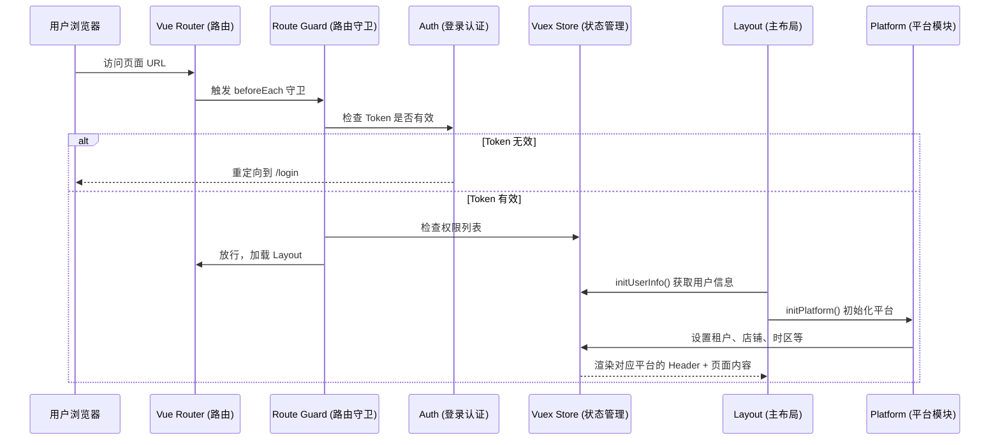

---

## 2. 模块一：登录模块（Login）

### 2.1 模块职责

登录模块负责用户身份验证，支持多种登录方式：
- 账号密码登录
- 手机验证码登录
- URL Token 免登录（用于外部系统跳转）
- SSO 单点登录

### 2.2 核心文件

| 文件 | 职责 |
|------|------|
| `views/login/login.vue` | 登录页面 UI |
| `api/login.js` | 登录相关 API 请求 |
| `utils/auth.js` | Token 的存取和校验 |
| `store/modules/user.js` | 用户状态管理 |


### 2.3 运用的设计模式

#### 模式一：门面模式（Facade Pattern）

> **通俗解释**：门面模式就像酒店的前台。你不需要知道酒店内部有多少部门（客房部、餐饮部、保洁部），你只需要跟前台说你的需求，前台帮你协调一切。

`utils/auth.js` 就是一个典型的门面。它把 `localStorage` 的复杂操作封装成简单的函数：

```javascript
// 门面：对外只暴露简单接口
export const getTokenInfo = () => { /* 从 localStorage 读取并解析 JSON */ }
export const setTokenInfo = (tokenInfo) => { /* 序列化后存入 localStorage */ }
export const isTokenValid = () => { /* 检查 token 是否过期 */ }
export const getAccessToken = () => { /* 获取 access token */ }
export const getJwt = () => { /* 获取 JWT token */ }
```

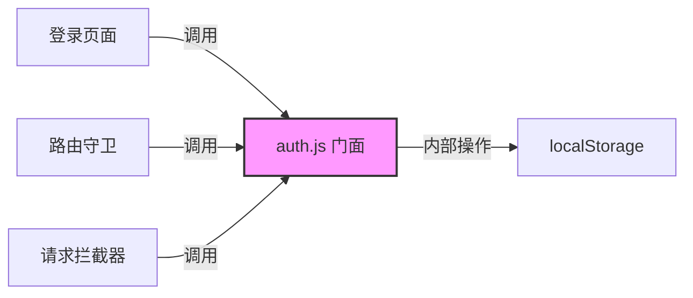

#### 模式二：策略模式（Strategy Pattern）

> **通俗解释**：策略模式就像导航软件里的"路线选择"。去同一个目的地，你可以选择"最快路线"、"最短路线"或"避开高速"，每种路线就是一个"策略"。

登录模块支持多种登录方式，每种方式就是一个独立的策略：

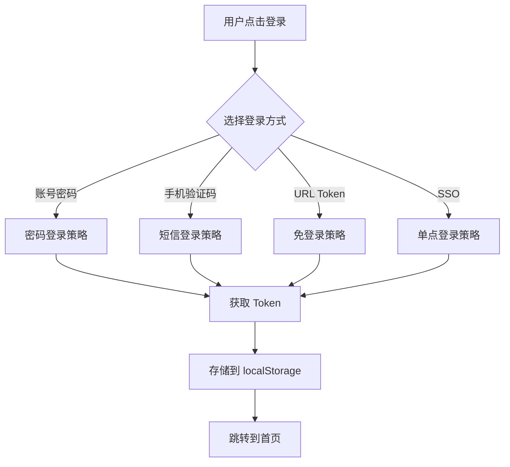

#### 模式三：令牌模式（Token Pattern）

> **通俗解释**：令牌模式就像游乐园的手环。你买票后获得一个手环（Token），之后玩任何项目只需要出示手环，不需要每次都重新买票。

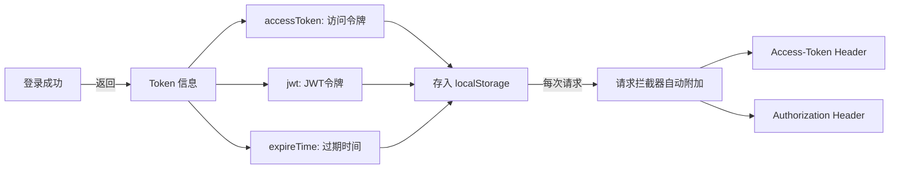

Token 的数据结构：
```javascript
{
  accessToken: "xxx",  // 访问令牌，放在请求头 Access-Token 中
  jwt: "yyy",          // JWT 令牌，放在 Authorization: Bearer 中
  expireTime: 1234567  // 过期时间戳，用于判断是否需要重新登录
}
```


---

## 3. 模块二：权限模块（Permission）

### 3.1 模块职责

权限模块控制"谁能看到什么、谁能操作什么"，实现了三个层级的权限控制：
1. **路由级别**：能不能进入某个页面
2. **组件级别**：页面内某个按钮/Tab 是否显示
3. **API 级别**：请求拦截器自动附加权限相关 Header

### 3.2 核心文件

| 文件 | 职责 |
|------|------|
| `permission.js` | 全局路由守卫（路由级权限） |
| `utils/permission.js` | 组件级权限判断工具 |
| `store/modules/user.js` | 权限列表的存储 |
| `utils/request.js` | API 请求拦截器（API 级权限） |

### 3.3 运用的设计模式

#### 模式一：责任链模式（Chain of Responsibility）

> **通俗解释**：责任链模式就像公司的审批流程。你提交一个请假申请，先经过组长审批，再经过经理审批，最后到 HR。每一环都可以决定"通过"或"拒绝"。

路由守卫 `permission.js` 中的 `beforeEach` 就是一条责任链：

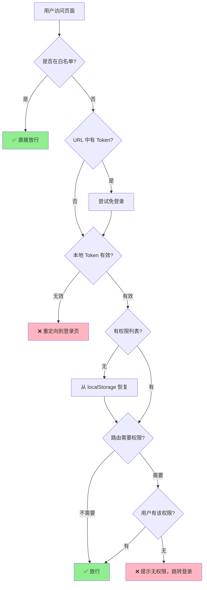

代码中的关键逻辑：
```javascript
// 白名单检查 → Token 检查 → 权限检查，层层过滤
router.beforeEach(async (to, from, next) => {
  // 第1关：白名单
  if (whiteList.indexOf(to.path) >= 0) { next(); return }
  
  // 第2关：Token 有效性
  if (!isTokenValid()) { next('/login'); return }
  
  // 第3关：路由权限
  if (to.meta?.key && permissions.indexOf(to.meta.key) < 0) { logout(); return }
  
  // 全部通过
  next()
})
```

#### 模式二：代理模式（Proxy Pattern）

> **通俗解释**：代理模式就像明星的经纪人。粉丝想见明星，不能直接找，得先通过经纪人。经纪人会帮你筛选、安排。

`utils/permission.js` 中的 `hasPermission` 函数就是一个代理，它代理了对 Vuex Store 中权限列表的访问：

```javascript
// 代理：不直接访问 store，而是通过这个函数统一判断
export const hasPermission = (codes) => {
  // 白名单页面直接通过
  if (whiteList.includes(router.currentRoute.path)) return true
  
  const permissions = store.getters.permission
  if (!permissions || permissions.length === 0) return false
  
  // 支持单个权限码或数组
  if (Array.isArray(codes)) {
    return codes.some(code => permissions.indexOf(code) >= 0)
  }
  return permissions.indexOf(codes) >= 0
}
```

在 Vue 组件中的使用方式：
```html
<!-- 组件级权限控制 -->
<el-button v-if="$hasPermission('AutomationEdit')">编辑</el-button>
```

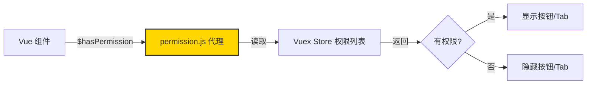

#### 模式三：拦截器模式（Interceptor Pattern）

> **通俗解释**：拦截器模式就像机场安检。每个旅客（请求）在登机（发送到服务器）前，都要经过安检（拦截器），安检员会检查你的证件（Token）并在你的登机牌上盖章（添加 Header）。

`utils/request.js` 中的 Axios 拦截器自动为每个请求附加认证信息：

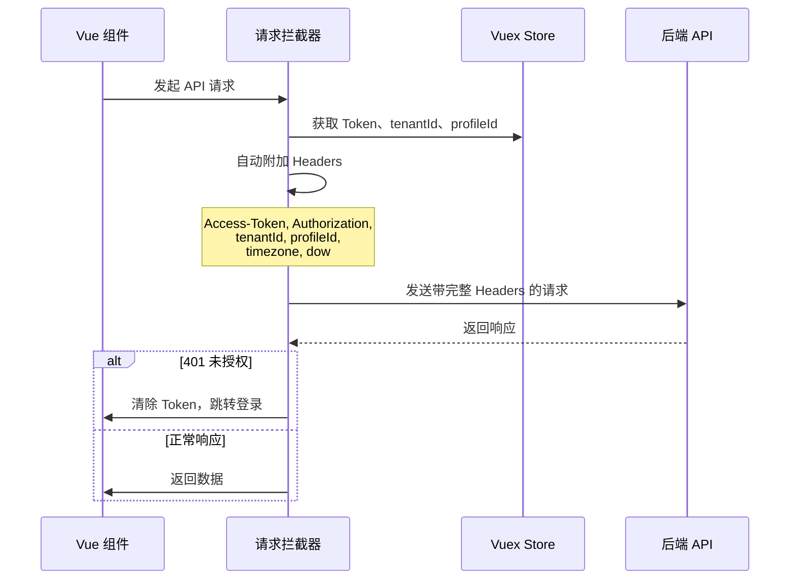

### 3.4 权限的三层防护体系

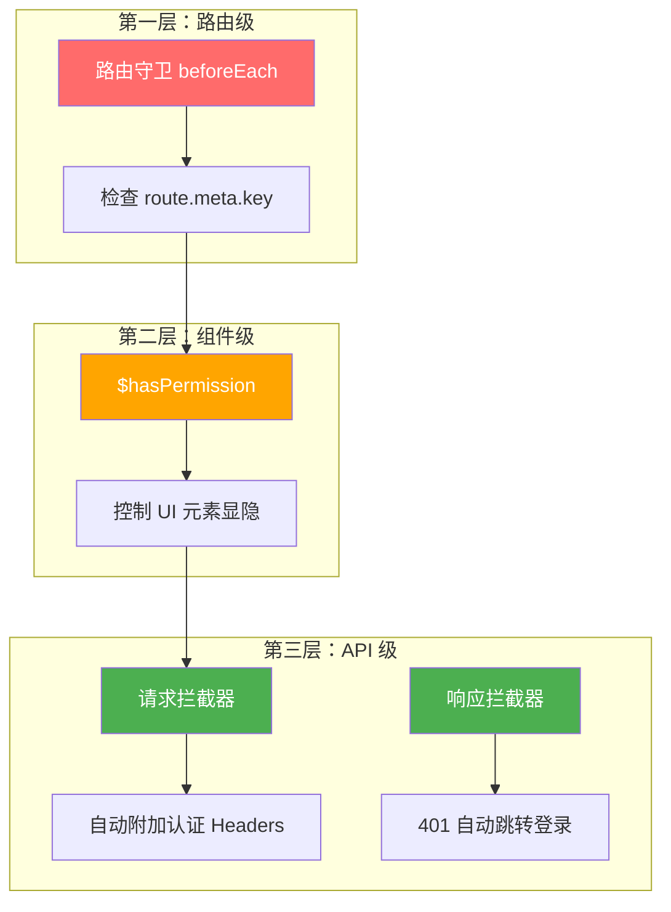


---

## 4. 模块三：路由模块（Router）

### 4.1 模块职责

路由模块管理整个应用的页面导航，决定"用户访问什么 URL 就看到什么页面"。

### 4.2 核心文件

| 文件 | 职责 |
|------|------|
| `router/index.js` | 路由主入口，汇总所有路由 |
| `router/modules/*.js` | 各业务模块的路由配置 |
| `router/platformB/index.js` | 平台B 专属路由 |
| `router/platformC/index.js` | 平台C 专属路由 |
| `platform/platformD/route/index.js` | 平台D 动态注册路由 |

### 4.3 运用的设计模式

#### 模式一：模块化模式（Module Pattern）

> **通俗解释**：模块化模式就像乐高积木。每个积木块（模块）都是独立的，你可以自由组合它们来搭建不同的东西。

路由被拆分成 20+ 个独立模块，每个模块管理自己的路由：

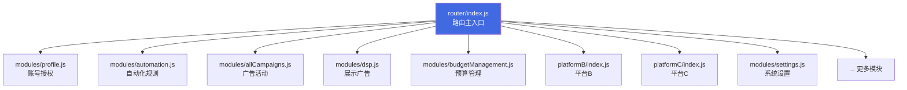

每个模块的结构都遵循统一的格式：
```javascript
// router/modules/automation.js — 一个典型的路由模块
export default {
  path: '/',
  component: Layout,        // 使用统一的主布局
  children: [
    {
      path: '/automation',
      name: 'Automation',
      component: () => import('@/views/automation/index'), // 懒加载
      meta: {
        key: 'AutomationView',  // 权限码
        breadcrumbs: [...]       // 面包屑导航
      }
    }
  ]
}
```

#### 模式二：装饰器模式（Decorator Pattern）

> **通俗解释**：装饰器模式就像给手机贴膜、装壳。手机本身的功能没变，但你给它"装饰"了额外的保护和美观。

路由的 `meta` 字段就是对路由的"装饰"，它不改变路由本身的导航功能，但附加了额外的元信息：

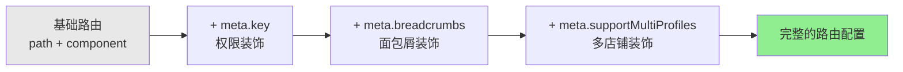

```javascript
meta: {
  key: 'HomePageV2',              // 装饰1：需要什么权限才能访问
  supportMultiProfiles: true,      // 装饰2：是否支持多店铺选择
  breadcrumbs: [{                  // 装饰3：面包屑导航配置
    label: 'route.homepageNew',
    to: '/home_new'
  }]
}
```

#### 模式三：懒加载模式（Lazy Loading）

> **通俗解释**：懒加载就像自助餐厅。你不会一次把所有菜都端到桌上，而是需要什么才去拿什么。这样既节省空间，又不浪费。

```javascript
// ❌ 不用懒加载：所有页面一次性全部加载，首屏很慢
import AutomationPage from '@/views/automation/index'

// ✅ 使用懒加载：只有用户访问时才加载对应页面
component: () => import('@/views/automation/index')
```

```mermaid
graph TD
    A[用户首次访问] --> B[只加载登录页 + 框架代码]
    B --> C[用户点击"自动化"]
    C --> D[动态加载 automation chunk]
    D --> E[渲染自动化页面]
    
    B --> F[用户点击"报表"]
    F --> G[动态加载 report chunk]
    G --> H[渲染报表页面]
    
    style B fill:#FFD700
    style D fill:#90EE90
    style G fill:#90EE90
```

#### 模式四：观察者模式（Observer Pattern）— afterEach 钩子

> **通俗解释**：观察者模式就像订阅微信公众号。你关注了一个公众号（注册监听），公众号发文章时（事件发生），你就会收到通知。

路由的 `afterEach` 钩子监听每次路由变化，自动执行一系列副作用：

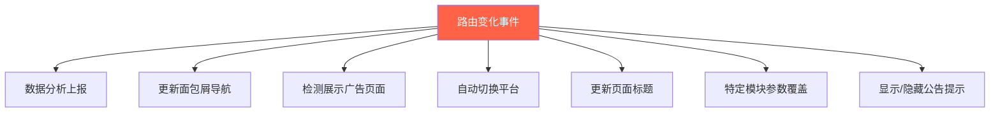


---

## 5. 模块四：账号模块（Account）

### 5.1 模块职责

账号模块管理多租户体系下的用户层级关系，包括：
- 租户（Tenant）管理
- 主账号 / 子账号体系
- 组长角色
- 店铺（Profile/Store）绑定与选择

### 5.2 核心文件

| 文件 | 职责 |
|------|------|
| `store/modules/user.js` | 用户身份信息状态 |
| `store/modules/global.js` | 租户、店铺等全局状态 |
| `views/subAccount/index.vue` | 子账号管理页面 |
| `api/account.js` | 账号相关 API |
| `layout/main/index.vue` | 用户信息初始化入口 |

### 5.3 运用的设计模式

#### 模式一：分层架构模式（Layered Architecture）

> **通俗解释**：分层架构就像一栋大楼。一楼是大厅（UI 层），二楼是办公室（业务逻辑层），地下室是仓库（数据层）。每层各司其职，互不干扰。

账号模块严格分为三层：

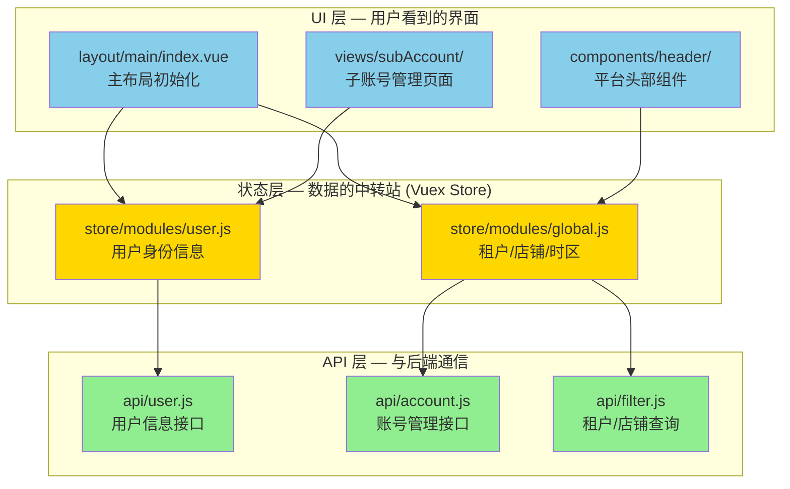

#### 模式二：组合模式（Composite Pattern）

> **通俗解释**：组合模式就像公司的组织架构图。公司下面有部门，部门下面有小组，小组下面有员工。每一级都可以包含下一级。

AdManager 的用户体系是一个典型的树形结构：

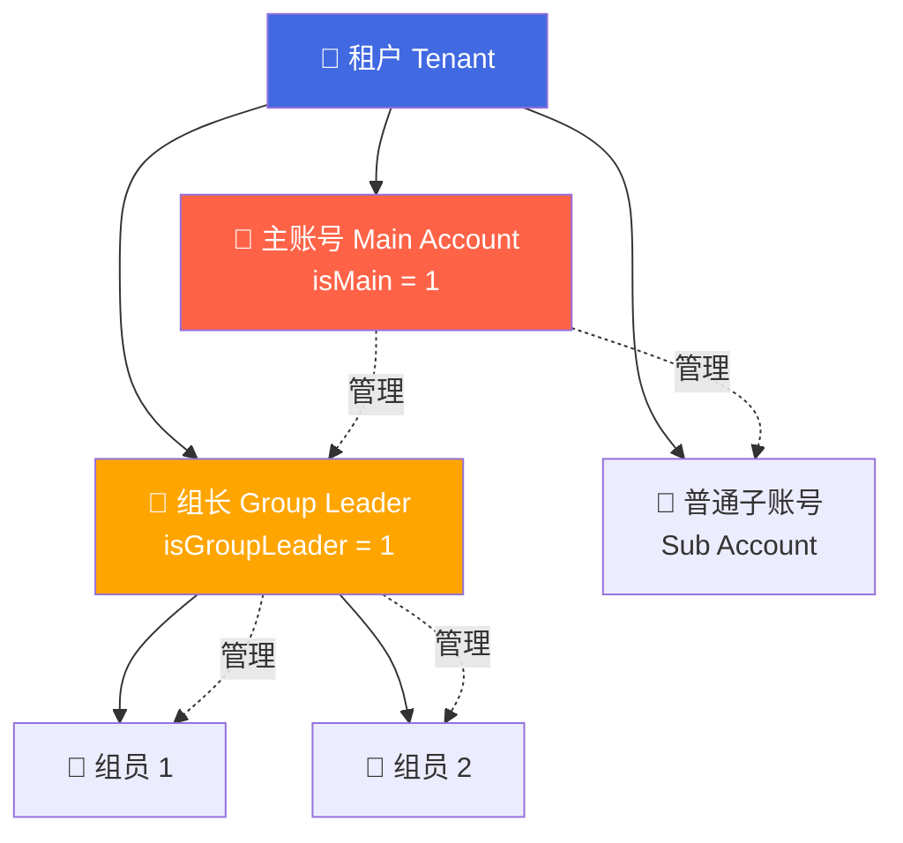

对应的状态字段：
```javascript
// store/modules/user.js 中的关键字段
const state = {
  isMain: 0,           // 是否为主账号 (0=否, 1=是)
  mainUserId: -2,      // 对应主账号的 ID
  isGroupLeader: 0,    // 是否为组长
  isAdmin: 0,          // 是否为内部管理员
  isSkuSkip: undefined, // 是否走商品SKU分权限逻辑
  skuAuthMode: undefined // 商品SKU分权限模式
}
```

#### 模式三：缓存模式（Cache Pattern）

> **通俗解释**：缓存模式就像你把常用的电话号码存在手机通讯录里。下次打电话时不用再去翻电话簿，直接从通讯录里找就行。

租户和店铺信息使用多级缓存策略：

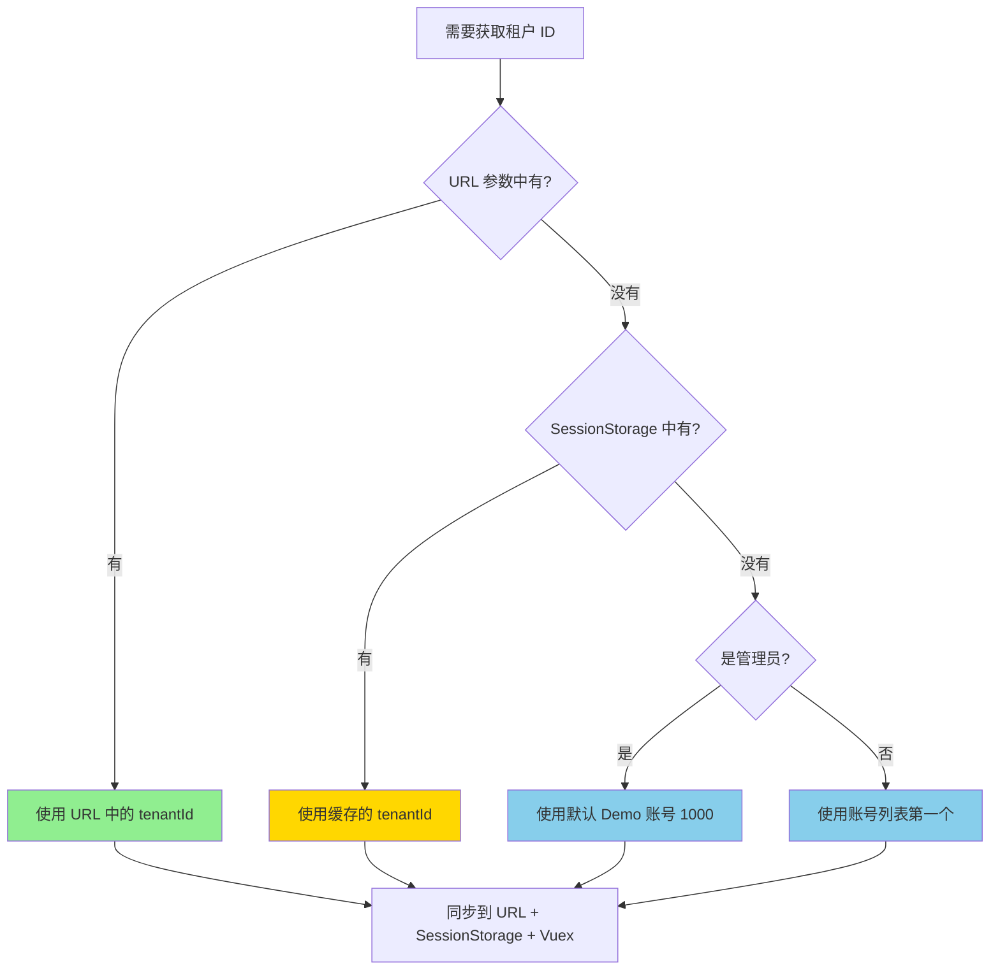

缓存优先级：**URL 参数 > SessionStorage > 默认值**

```javascript
// global.js 中的缓存逻辑
// 1. 优先尝试 URL 中的 tenantId
let tenantId = Number(qs.parse(location.search.slice(1))?.tenantId)

// 2. 其次尝试缓存的 tenantId
const cachedTenantId = Number(getCache(tenantIdKey, { place: 'session' }))

// 3. 最后使用默认值
tenantId = store.getters.isAdmin === 1 ? 1000 : accounts?.[0]?.accountId
```

#### 模式四：命令模式（Command Pattern）

> **通俗解释**：命令模式就像遥控器。你按一个按钮（发出命令），电视就执行对应的操作。每个按钮对应一个具体的操作。

Vuex 的 `mutations` 和 `actions` 就是命令模式的体现：

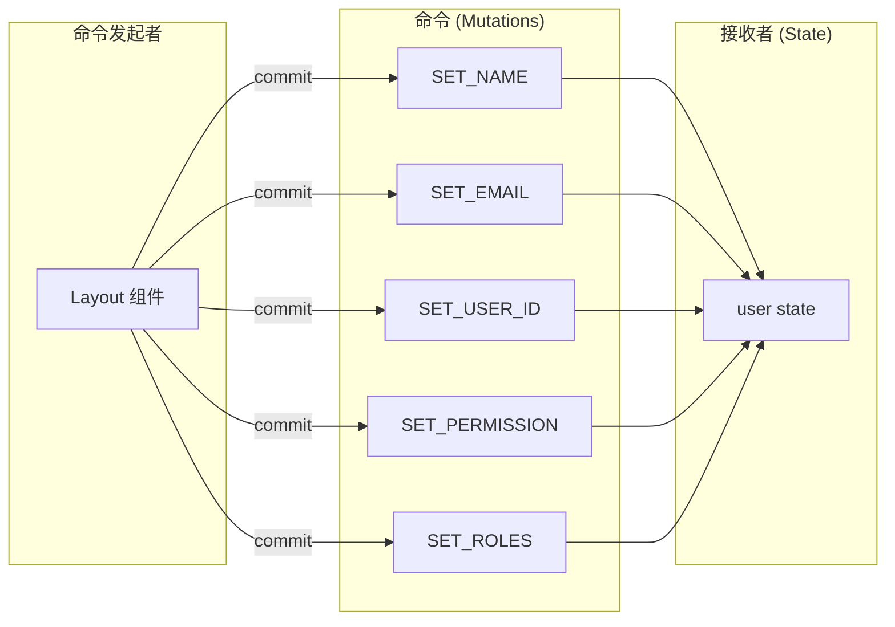


---

## 6. 模块五：平台模块（Platform）

### 6.1 模块职责

平台模块是 AdManager 最具特色的架构设计，它让系统能够支持多个广告平台（平台A、平台B、平台C、平台D 等），并且新增平台时不需要修改已有代码。

### 6.2 核心文件

| 文件 | 职责 |
|------|------|
| `platformCenter/index.js` | PlatformCenter 入口，平台匹配 |
| `platformCenter/store.js` | 统一的平台状态管理 |
| `store/modules/global.js` | 全局平台状态（含传统平台） |
| `platform/platformD/platformConfig.js` | 平台D 配置（插件） |
| `platform/platformD/adapters/*.js` | 平台D 数据适配器 |
| `layout/main/index.vue` | 根据平台渲染不同 Header |

### 6.3 运用的设计模式

#### 模式一：插件模式（Plugin Pattern）⭐ 最核心

> **通俗解释**：插件模式就像浏览器的扩展插件。Chrome 浏览器本身提供基础功能，你可以安装各种插件（广告拦截、翻译等）来扩展功能。每个插件都遵循统一的接口规范。

PlatformCenter 是一个插件管理器，每个平台都是一个插件：

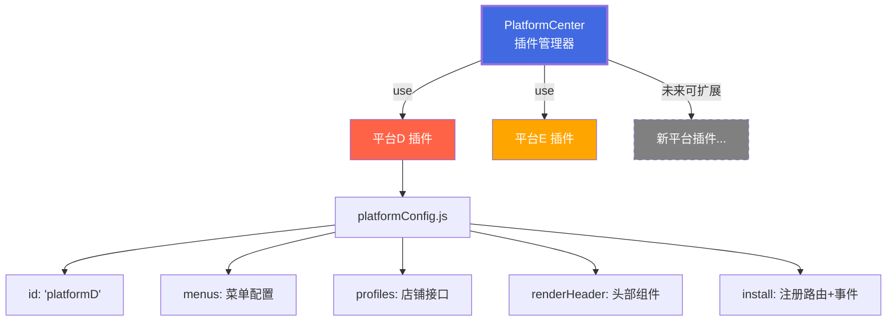

插件的标准接口（每个平台都必须实现）：

```javascript
// platform/platformD/platformConfig.js — 一个平台插件的完整定义
export default {
  id: 'platformD',                    // 唯一标识，也是路由前缀
  name: '平台D',                      // 显示名称
  icon,                               // 平台图标
  permission: 'PlatformDEntry',       // 进入该平台需要的权限
  menus: getPlatformDMenus,           // 侧边栏菜单
  profiles: {                         // 店铺相关接口
    list: getPlatformDStore,          //   获取店铺列表
    getById: getPlatformDStoreById    //   根据 ID 获取店铺
  },
  renderHeader: h => h(PlatformDHeader), // 自定义头部组件
  supportLanguages: ['en'],           // 支持的语言
  supportCurrencies: ['USD'],         // 支持的货币
  install() {                         // 安装钩子
    router.addRoute(platformDRoute)   //   动态注册路由
    eventBus.$on('loginSuccess', ...) //   监听登录事件
  }
}
```

注册过程：
```javascript
// main.js 中注册平台插件
import PlatformCenter from '@/platformCenter'
import platformDConfig from '@/platform/platformD/platformConfig'

PlatformCenter.use(platformDConfig)  // 注册平台D
```

#### 模式二：策略模式（Strategy Pattern）— 平台初始化

> 不同平台有不同的初始化策略，`initPlatform` 根据当前平台选择对应的策略执行。

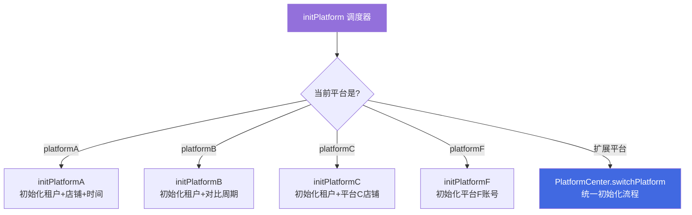

```javascript
// global.js — 策略调度
async initPlatform({ state, dispatch }) {
  switch (state.platform) {
    case 'platformA':  dispatch('initPlatformA'); break
    case 'platformB':  dispatch('initPlatformB'); break
    case 'platformC':  dispatch('initPlatformC'); break
    case 'platformF':  dispatch('initPlatformF'); break
    default:
      if (PlatformCenter.isExtPlatform(state.platform)) {
        await PlatformCenter.switchPlatform(state.platform) // PlatformCenter 统一处理
      }
  }
}
```

#### 模式三：适配器模式（Adapter Pattern）

> **通俗解释**：适配器模式就像电源转换插头。你的中国电器（平台D API 数据格式）到了美国（AdManager 统一数据格式），需要一个转换插头（Adapter）才能正常使用。

每个平台的 API 返回的数据格式不同，适配器负责将它们转换成系统统一的格式：

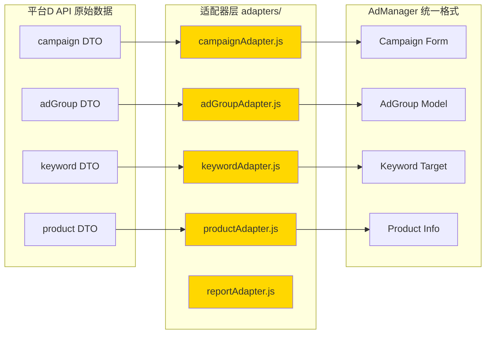

适配器的典型用法：
```javascript
// adapters/index.js — 统一导出所有适配器
export { campaignDetailToForm, formToCampaignRequest } from './campaignAdapter.js'
export { adGroupFromDTO, adGroupToDTO } from './adGroupAdapter.js'
export { keywordFromDTO, keywordDTOToTarget } from './keywordAdapter.js'
export { productFromCatalogDTO, productFromAdGroupDTO } from './productAdapter.js'
export { normalizeSummaryFromDTO, normalizeListFromDTO } from './reportAdapter.js'
```

#### 模式四：状态机模式（State Machine）— 平台切换

> **通俗解释**：状态机就像红绿灯。灯只能处于"红"、"黄"、"绿"三种状态之一，并且状态之间的切换有固定的规则。

PlatformCenter 的平台切换就是一个状态机：

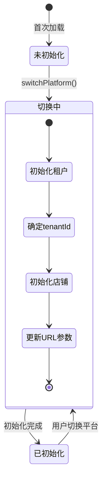

```javascript
// platformCenter/store.js — 状态机控制
const firstInited = ref(false)        // 是否首次初始化过
const switchingPlatform = ref(false)  // 是否正在切换

const switchPlatform = async (platformId) => {
  if (switchingPlatform.value) return  // 防止重复切换
  switchingPlatform.value = true       // 进入"切换中"状态
  
  await _initAccount()                 // 步骤1：初始化租户
  await _initTenantId(urlParams)       // 步骤2：确定 tenantId
  await _initProfileIds(platformId)    // 步骤3：初始化店铺
  updateUrlQuery(...)                  // 步骤4：更新 URL
  
  switchingPlatform.value = false      // 退出"切换中"状态
  firstInited.value = true             // 标记已初始化
}

// 只有 firstInited && !switching 时才渲染主区域
const inited = computed(() => firstInited.value && !switchingPlatform.value)
```

#### 模式五：工厂模式（Factory Pattern）— Header 渲染

> **通俗解释**：工厂模式就像一个万能工厂。你告诉工厂你要什么产品（平台类型），工厂就给你生产对应的产品（Header 组件）。

Layout 根据当前平台动态选择渲染哪个 Header 组件：

```mermaid
graph TD
    A[Layout 主布局] --> B{activePlatform?}
    B -->|platformA| C[PlatformAHeader]
    B -->|platformB| D[PlatformBHeader]
    B -->|platformC| E[PlatformCHeader]
    B -->|platformF| F[PlatformFHeader]
    B -->|扩展平台| G[ExtHeader<br/>由 platformConfig.renderHeader 决定]
    
    G --> H[PlatformDHeader]
    G --> I[PlatformEHeader]
    G --> J[未来新平台 Header...]
    
    style A fill:#4169E1,color:#fff
    style G fill:#FF6347,color:#fff
```

```html
<!-- layout/main/index.vue — 工厂选择 -->
<PlatformAHeader v-if="activePlatform === 'platformA'" />
<PlatformFHeader v-else-if="activePlatform === 'platformF'" />
<PlatformBHeader v-else-if="activePlatform === 'platformB'" />
<PlatformCHeader v-else-if="activePlatform === 'platformC'" />
<ExtHeader v-else />  <!-- PlatformCenter 管理的平台统一使用 ExtHeader -->
```


---

## 7. 五大模块协作全景图

### 7.1 模块间的依赖关系

```mermaid
graph TD
    LOGIN[🔐 登录模块<br/>Login] -->|产出 Token| AUTH[🎫 Token 存储<br/>localStorage]
    AUTH -->|Token 校验| PERM[🛡️ 权限模块<br/>Permission]
    PERM -->|路由守卫| ROUTER[🗺️ 路由模块<br/>Router]
    ROUTER -->|加载 Layout| ACCOUNT[👤 账号模块<br/>Account]
    ACCOUNT -->|初始化用户信息| PLATFORM[🌐 平台模块<br/>Platform]
    
    PERM -->|权限列表| ACCOUNT
    PLATFORM -->|平台路由| ROUTER
    AUTH -->|请求拦截| PLATFORM
    
    style LOGIN fill:#FF6347,color:#fff
    style PERM fill:#FFA500,color:#fff
    style ROUTER fill:#4169E1,color:#fff
    style ACCOUNT fill:#9370DB,color:#fff
    style PLATFORM fill:#2E8B57,color:#fff
```

### 7.2 完整的用户访问流程

```mermaid
sequenceDiagram
    participant U as 👤 用户
    participant Login as 🔐 登录模块
    participant Router as 🗺️ 路由模块
    participant Perm as 🛡️ 权限模块
    participant Account as 👤 账号模块
    participant Platform as 🌐 平台模块
    participant API as 🖥️ 后端服务

    Note over U,API: === 阶段一：登录 ===
    U->>Login: 输入账号密码
    Login->>API: 发送登录请求
    API-->>Login: 返回 Token + 权限列表
    Login->>Login: 存储 Token 到 localStorage
    Login->>Perm: 存储权限列表到 Vuex

    Note over U,API: === 阶段二：路由导航 ===
    U->>Router: 访问 /home_new
    Router->>Perm: beforeEach 路由守卫
    Perm->>Perm: 检查白名单 → Token → 权限
    Perm-->>Router: ✅ 放行

    Note over U,API: === 阶段三：初始化 ===
    Router->>Account: 加载 Layout，触发 init()
    Account->>API: 请求用户信息 (userInfo)
    API-->>Account: 返回用户角色、版本等
    Account->>Account: 存储到 Vuex Store

    Account->>Platform: initPlatform()
    Platform->>Platform: 检测当前平台 (platformA/platformB/...)
    Platform->>API: 请求租户列表、店铺信息
    API-->>Platform: 返回数据
    Platform->>Platform: 设置 tenantId、curStore、timeZone

    Note over U,API: === 阶段四：页面渲染 ===
    Platform-->>U: 渲染对应平台的 Header + 页面内容

    Note over U,API: === 阶段五：日常操作 ===
    U->>API: 点击按钮发起请求
    Note over API: 请求拦截器自动附加:<br/>Access-Token, tenantId,<br/>profileId, timezone
    API-->>U: 返回业务数据
```

### 7.3 平台切换流程

```mermaid
sequenceDiagram
    participant U as 👤 用户
    participant Nav as 📋 侧边栏
    participant Router as 🗺️ 路由模块
    participant Guard as 🛡️ afterEach 守卫
    participant Global as 🌐 Global Store
    participant Center as 🔌 PlatformCenter

    U->>Nav: 点击切换到平台D
    Nav->>Router: router.push('/platformD/...')
    Router->>Guard: afterEach 触发
    Guard->>Guard: matchPlatform('/platformD/...')
    Guard->>Global: setPlatform('platformD')
    Global->>Center: PlatformCenter.isExtPlatform?
    Center-->>Global: ✅ 是扩展平台
    Global->>Center: switchPlatform('platformD')
    Center->>Center: 初始化租户 → 店铺 → URL
    Center-->>U: 渲染平台D页面
```

---

## 8. 设计模式总结表

| 设计模式 | 所在模块 | 具体应用 | 一句话解释 |
|---------|---------|---------|-----------|
| **门面模式** (Facade) | 登录 | `utils/auth.js` 封装 Token 操作 | 把复杂操作藏在简单接口后面 |
| **策略模式** (Strategy) | 登录 / 平台 | 多种登录方式 / 多平台初始化 | 同一个目标，不同的实现方式 |
| **令牌模式** (Token) | 登录 | JWT + accessToken 双令牌认证 | 一次登录，处处通行 |
| **责任链模式** (Chain of Responsibility) | 权限 | 路由守卫的层层检查 | 请求沿着链条传递，每环都能拦截 |
| **代理模式** (Proxy) | 权限 | `$hasPermission` 代理权限判断 | 通过中间人访问目标对象 |
| **拦截器模式** (Interceptor) | 权限 | Axios 请求/响应拦截器 | 在请求前后自动执行额外逻辑 |
| **模块化模式** (Module) | 路由 | 路由拆分为 20+ 独立模块 | 大系统拆成小积木 |
| **装饰器模式** (Decorator) | 路由 | `route.meta` 附加权限/面包屑 | 不改原有功能，附加额外信息 |
| **懒加载模式** (Lazy Loading) | 路由 | `() => import(...)` 动态导入 | 需要时才加载，节省资源 |
| **观察者模式** (Observer) | 路由 / 平台 | `afterEach` 钩子 / `eventBus` | 事件发生时自动通知所有监听者 |
| **分层架构** (Layered) | 账号 | UI → Store → API 三层分离 | 每层各司其职，互不干扰 |
| **组合模式** (Composite) | 账号 | 租户→主账号→组长→子账号 树形结构 | 用树形结构表示整体-部分关系 |
| **缓存模式** (Cache) | 账号 | URL → Session → 默认值 三级缓存 | 优先用缓存，减少重复请求 |
| **命令模式** (Command) | 账号 | Vuex mutations 封装状态变更 | 把操作封装成对象 |
| **插件模式** (Plugin) ⭐ | 平台 | PlatformCenter.use(platformConfig) | 核心系统 + 可插拔扩展 |
| **适配器模式** (Adapter) | 平台 | 平台D adapters 数据转换 | 让不兼容的接口协同工作 |
| **状态机模式** (State Machine) | 平台 | 平台切换的状态管理 | 有限状态之间的有序转换 |
| **工厂模式** (Factory) | 平台 | 根据平台类型渲染不同 Header | 根据条件创建不同的对象 |

---

## 附录：关键概念速查

### 对于入门开发者的建议

1. **先理解数据流**：用户操作 → 组件 → Vuex Store → API → 后端，这是最基本的数据流向
2. **先看 `permission.js`**：这是理解整个系统的最佳入口，它串联了登录、权限、路由三大模块
3. **再看 `layout/main/index.vue`**：这是系统的"总控室"，理解了它就理解了初始化流程
4. **最后看 `platformCenter/store.js`**：这是最复杂但也最精妙的部分，理解了它就理解了多平台架构

### 核心数据存储位置

| 数据 | 存储位置 | 持久化方式 |
|------|---------|-----------|
| Token (accessToken, jwt) | localStorage['app-token'] | 浏览器关闭后仍保留 |
| 权限列表 | Vuex + localStorage['access_action'] | 双重存储，互为备份 |
| 当前租户 ID | Vuex + URL 参数 + SessionStorage | 三重同步 |
| 当前店铺 | Vuex + URL 参数 | 刷新后从 URL 恢复 |
| 当前平台 | Vuex (根据 URL path 自动检测) | 无需持久化 |
| 日期范围 | Vuex + localStorage (按平台隔离) | 按平台分别缓存 |